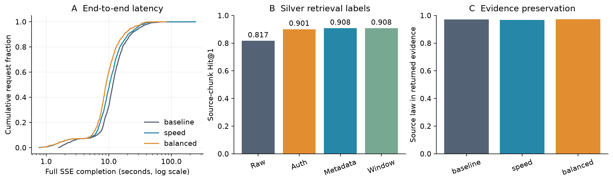

# 지능형 법령 검색의 속도·정확도 후속 실험

실험일: 2026-09-05. 400개 고유 질문의 종단 3,200회와 추가 대조 실험을 완료했다.
주·추가 워크로드 8,353행, 전송 재생 340문항, CPU 감사 및 별도 분류 진단 5회를
검증했다. 실험 결과이며 운영 배포나 전문가 정확도 인증은 아니다.

핵심 결과는 SSE 종단 평균 22.89% 감소, JSON 평균 9.74% 감소, 리랭커 복구의
출처 조문 Top-1 +8.40%p다. 별도 검색 전용 경로에서는 원 질문을 유지하고
생성형 추출을 생략해 8.03배의 관측 가속을 얻었다. 이때 기존 문서와의 Recall은
전체 400문항에서 0.345, 출처 조문 평가와 같은 131문항에서 0.512였지만,
출처 조문 Top-1은 0.916이었다. 따라서 기존 출력 일치도와
출처 적중률을 구분해야 한다. 최종 답변 자동 평가의 유의한 개선·동등성은
입증하지 못했고, 전문가 gold는 아직 없다.

## 실험의 범위

`.53`의 기존 H200 NVL 2개에 상주한 모델 서비스를 사용했다. `.52`는 확인 결과
GPU가 없는 앱 서버여서 앱→GPU 서버의 네트워크 측정에 사용했다. 운영 모델
서버를 재시작하거나 운영 Python 패키지를 교체하지 않았다. 앱 소스 복사본과
별도 loopback 프로세스에서 실행했으며, 검색 대상은 실제 공유 색인이다.

이전 실험의 “baseline 문서와 얼마나 같은가”를 절대 정확도로 취급하지 않는다.
이번에는 출처 문서에서 만든 silver known-item 라벨을 추가했고, 종단 지연과
자동 답변 근거 평가를 분리한다. 전문가 정답 라벨은 아직 0개다.

세 종단 조건:

| 조건 | 적용 내용 |
|---|---|
| baseline | 현재 소스의 순차 실행·프록시 경로, 인증이 누락된 리랭커 |
| speed | 동일 모델 직접 연결, typed dispatch, 입력 일치 확인 후 준비 단계 중첩, 진행 중 동일 임베딩 합치기, 반복 설정 호출 감소, 인위적 전송 지연 제거 |
| balanced | speed + 리랭커 인증 복구 + gpt-oss 스트리밍 답변의 낮은 추론량 |

모델·임베딩 접속 인증과 가드레일 인증은 **모든 조건에 공통으로** 복구했다.
baseline은 과거 날짜의 배포 서비스가 아니라 이번 소스·환경에 고정한 비교군이다.
JSON `/api/generate`와 SSE `/api/generate/stream`은 구현 경로가 달라 별도로 측정한다.
낮은 추론량 설정은 SSE 답변에만 적용된다.

복구한 재정렬은 설정된 Top-20을 반환한다. 반면 기존 401 fallback은 후보 전체를
반환할 수 있으므로, balanced의 종단 효과에는 후보 수·생성 문맥 차이도 포함된다.
본문 입력은 설정 길이의 접두부를 사용하며 원 helper의 말줄임표를 붙이지 않는다.
인증 헤더만 byte-for-byte 바꾼 대조군 또는 추론량만 바꾼 종단 조건은 아니다.

## 400문항과 평가 단위

| 유형 | 문항 수 |
|---|---:|
| 법령명 검색 | 80 |
| 출처 조문 기반 질문 | 63 |
| 출처 의미를 재서술한 질문 | 68 |
| 생성 검증 실패 후 법령·조문명 검색으로 대체 | 29 |
| 상황형 법령 검색 | 100 |
| 국가 비교 | 20 |
| 자기완결적 번역 | 20 |
| 대화·서비스 안내·범위 밖 | 20 |
| 합계 / 고유 질문 | 400 / 400 |

출처형 240문항은 서로 다른 법령 240개, 57개 국가·지역·기구에 걸친다.
법령명 질문에 임의의 조문을 유일 정답으로 지정하지 않기 위해 법령 적중률은
240문항, 정확한 조문 적중률은 참조 답변이 실제 원문 부분 문자열인지 검증된
131문항에만 계산한다. 나머지 160문항에는 정답 문서 ID를 임의로 만들지 않았다.

이 라벨은 완전한 관련 문서 목록도, 전문가 gold도 아니다. 다른 관련 문서가
정답일 수 있고, 원문에 참조 문장이 존재한다는 검사는 질문의 법률적 타당성을
보증하지 않는다. 실제 질의 로그의 분포를 대표한다는 주장도 하지 않는다.

- 질문 파일 SHA-256: `3dc548a420aab36e082f8d727cf773fd6ec720912cd7858a966369031da8677d`
- 질문 생성 시 색인: 번역 453,965건 + 원문 3,197,052건 = 3,651,017건.
- 앱 Python 소스 트리 SHA-256: `60e10a4ee472daaf268ddaaaa2340d81c971c01c4986c052d0fb09885dc8fedd`.
- 예비 24문항은 본 400문항과 법령 ID가 겹치지 않는다. 예비 결과는 본 평가에 합산하지 않는다.

## 완료: 실제 검색 및 재정렬 1,200회

400문항을 세 번 검색했다. 질문별 첫 대형 모델 추출 결과를 고정하고, 매번 같은
후보 집합을 네 방식으로 평가했다. 재정렬 호출 순서는 회전했다. 1,200/1,200회
완료했다. 아래 조문 지표는 131문항 × 3반복이며, 추출 시간은 포함하지 않는다.

| 재정렬 | 출처 조문 Hit@1 | Hit@5 | MRR@20 | 검색+재정렬 평균 |
|---|---:|---:|---:|---:|
| raw | 0.8168 | 0.9695 | 0.8817 | 0.337초 |
| 인증 복구, 기존 본문 | 0.9008 | 0.9618 | 0.9245 | 0.438초 |
| 국가·제목·조문 메타데이터 | 0.9084 | 0.9695 | 0.9307 | 0.443초 |
| 질의 관련 본문 구간 | 0.9084 | 0.9695 | 0.9307 | 0.441초 |

인증 복구는 Hit@1을 **8.40%p** 개선했다(107/131→118/131). MRR@20 증가량은
0.04283, 질문 단위 bootstrap 95% CI는 [0.00614, 0.08079]였다. 첫 반복만 사용한
McNemar 비교는 개선 15문항·악화 4문항, 양측 p=0.01921이며, 세 재정렬 후보
비교의 Holm 보정 p=0.03545였다. 반복을 독립 질문으로 부풀리지 않았다.

이것은 재정렬이 후보를 새로 찾아내는 결과가 아니라 **이미 찾은 출처 조문의 순위
개선**이다. Hit@20은 모든 조건에서 0.9695였다. 인증 복구의 Hit@5는 오히려
한 문항 낮으므로 모든 cut-off에서 개선됐다고 주장하지 않는다. 메타데이터·구간
입력은 인증 복구보다 Top-1 한 문항만 더 맞혔고, 그 추가 효과의 유의성을
입증하지 않았다. 독립 예비셋에서 세 입력이 동률이어서 종단 조건은 단순한 기존
본문 입력으로 미리 선택했다.

| 출처 질문 유형 | 고유 문항 | raw 조문 Hit@1 | 본문 리랭커 | 메타데이터·구간 |
|---|---:|---:|---:|---:|
| 법령명·조문 주제 명시 | 63 | 0.7937 | 0.9048 | 0.8889 |
| 출처 의미 재서술 | 68 | 0.8382 | 0.8971 | 0.9265 |

이는 하위집단의 기술 통계다. 두 유형은 같은 법령의 짝지은 표현 변형이 아니므로,
법령명을 쓰거나 생략한 것 자체의 인과 효과로 해석하지 않는다. 이 결과를 보고
유형별 리랭커를 골라 본셋 성능을 다시 높이는 사후 선택도 하지 않았다.

오류 형태를 분해하면 해석이 더 명확하다. 131문항의 첫 반복에서 raw Top-1은
출처 조문 107개·같은 법령의 다른 조문 19개·다른 법령 5개였다. 인증 복구 후에는
각각 118·8·5개였다. 개선 15개와 악화 4개는 모두 **같은 법령 안에서 어떤 조문을
맨 위에 놓는가**의 변화였다. 따라서 이 부분집합의 +8.40%p를 “법령 자체를 더
잘 찾아냈다”고 설명하면 안 된다. 이 분해도 단일 출처 ID 기준이지, 다른 조문의
법률적 관련성을 전문가가 기각했다는 뜻은 아니다.

### 추가 입력 잘림 대조군: 400회

본 측정 후 첫 추출을 고정하고 400회 새로 검색하여, 단순 본문 접두부와 원본
helper의 공백 제거·말줄임표 처리까지 사용한 인증 복구를 비교했다. 400/400회
완료했고, 131개 출처 조문 Hit@1·MRR@20과 240개 출처 법령 지표는 두 입력에서
동일했다. 따라서 이 대조군에서는 +8.40%p의 조문 Top-1 증가가 잘림 처리 변경만의
산물이라는 증거가 없었다.

다만 전체 Top-20 문서 순서가 정확히 같은 질문은 320/400(80%)이었다.
단일 출처 적중 지표의 일치가 전체 순위 보존이나 모든 질문에서의 일반적 동등성을
뜻하지 않는다. 후보 수·생성 문맥 차이가 있는 종단 composite의 교란도 이 작은
입력 대조만으로 제거된 것은 아니다.

## 완료: 동일 서빙 추출 반복 800회

400문항을 같은 준비 단계로 두 번 실행했다. 국가·변환 질의·키워드 필드가 모두
같은 경우는 397/400(99.25%), 국가 일치는 100%, 키워드 집합 Jaccard 평균은
0.99785였다. 준비 실패는 없었다. 두 회차 평균은 3.009초와 2.987초였다.

이는 같은 서빙에서도 관측 출력이 달라질 수 있다는 대조군이다. **과거 n-gram의
392/400 일치에서 나머지 8개가 모두 비결정성 때문이라고 소급 판정하는 근거는
아니다.** 작은 회차 간 시간 차이도 최적화 효과로 보고하지 않는다.

## 완료: 반복 일치도에 가려진 국가 후처리 오류

고정 앱의 순수 국가 해석 함수와 실제 추출 시 저장한 지원 국가 목록으로
400문항을 CPU에서 재생했다. 모델·DB를 추가 호출하지 않았으며 함수 파일
SHA-256이 실험 앱의 원본 해시와 일치함을 검증했다.

출처형 240문항 중 최종 준비 국가가 출처와 다른 경우는 **7개**였다.
이 7개는 모두 사용자 문장에서 국가를 다시 고르는 결정적 후처리 함수도
동일하게 출처와 다른 값을 반환했다. 같은 서빙의 국가 추출 반복 일치율 100%는
이 오류를 발견하지 못한다. 새 출처 라벨이 잡아낸 오류다.

| 입력의 최소 차이 | 원 함수의 관할명 |
|---|---|
| `중국 홍콩특별행정구의 법령` | 중국 |
| `중국 홍콩특별행정구 의 법령` | 중국 홍콩특별행정구 |
| `중국 마카오특별행정구에서 적용되는 법령` | 중국 |
| `중국 마카오특별행정구 에서 적용되는 법령` | 중국 마카오특별행정구 |

긴 관할명 뒤의 한글 조사가 경계 검사에서 거부되고, 앞의 짧은
이름이 먼저 선택되는 현상이다. Top-20에서 출처 조문을 못 찾은 4문항 중
3문항(q002·q094·q149)에서 준비 국가가 출처와 달랐다. 나머지 한 문항(q193)은
국가가 일치했다. 이 관찰만으로 국가 보정 후 회복량을 단정하지 않고 별도
검색 대조군으로 검증한다.

긴 이름부터 중첩을 제거하고 유일한 명시 관할명만 선택하는 CPU 대안은
236/240문항에서 출처와 일치했고 4개는 복수 관할 때문에 보류했다. 이 데이터는
생성 시 국가명을 질문에 명시하게 했으므로 실제 로그·별칭·생략 질의의 100%
정확도를 뜻하지 않는다. 특히 대만에서 미국·일본으로 수출하는 질문(q002)은
여러 국가 중 적용 관할을 해석해야 하며 단순 문자열 선택만으로 해결됐다고
주장하지 않는다. 국가만 보정하는 검색 대조군에서는 애매하면 기존 값을 유지한다.

종단과의 연결도 별도로 확인했다. 첫 SSE 반복에서는 국가 불일치 7문항 모두
출처 법령을 반환했다. trace상 q094·q149는 각각 특별행정구와 중국의 두 검색을,
q002는 미국·일본·대만의 세 검색을 수행했다. 즉 단독 준비·검색의 실패가 여러
하위 질의로 확장되는 전체 경로에서는 그대로 최종 누락이 되지 않았다. 추가
관할 검색이 질문에 필요한지와 답변에 관할 혼동을 만드는지는 별도 검증 사항이다.
이번 국가-only 대조군의 검색 적중률을 종단 정확도 증가량으로 대입하지 않는다.

## 완료: 네트워크 및 패키지 호환성 분리 측정

연결 방식당 400회 health 요청을 실제 측정했다. LLM 추론을 포함하지 않는다.

| 경로 | 매번 새 연결 평균 | 연결 재사용 평균 |
|---|---:|---:|
| .52 앱 서버 → .53 모델 서버 | 1.699ms | 1.042ms |
| .53 loopback | 0.807ms | 0.588ms |

현재 네트워크에서 연결 재사용만의 절감은 밀리초 수준이다. 프록시 우회가 LLM
추론·스케줄·전송까지 포함해 어떤 효과를 내는지는 고정 프롬프트 대조군과 종단
실험으로 따로 판단해야 한다. health 측정으로 초 단위 가속을 주장하지 않는다.

기존 vLLM 0.19.0 / NumPy 2.4.4 / Numba 0.61.2 조합에서는 n-gram 관련 import가
NumPy 버전 충돌로 실패함을 재현했다. 운영 환경을 바꾸지 않고 별도 target 경로에
Numba 0.65.1 / llvmlite 0.47.0을 설치하니 import와 JIT가 성공했다. 400개 질문에서
만든 정수 시퀀스에 대해 k={1,3,5,8}, lookup={1–2,2–4,2–8}, 세 반복 구조의
14,400개 CPU 제안기 검사를 수행했고, 단순 참조 구현과 14,400/14,400 일치했다.

이는 **CPU 호환성과 제안기 검사**다. 정수 시퀀스는 문자 코드 기반이며 Gemma
토크나이저 출력이 아니다. 31B 실제 생성의 수용률·무손실성·GPU 가속이나
운영 업그레이드 완료를 의미하지 않는다. Numba의 지원 범위는
[공식 설치 호환표](https://numba.readthedocs.io/en/stable/user/installing.html)를 함께 참고한다.

추가 서빙 후보도 실제 지원 문서를 확인했다. Google은
[Gemma 4 MTP 구조](https://ai.google.dev/gemma/docs/mtp/overview)를 공개했고,
vLLM Speculators에는
[31B용 EAGLE-3 체크포인트](https://docs.vllm.ai/projects/speculators/en/v0.6.0/user_guide/algorithms/eagle3/)가
명시되어 있다. 다만 설치된 vLLM 0.19.0의 파일·모델 레지스트리에는 Gemma 4
기본 모델은 있으나 `gemma4_mtp` 구현은 없었다. 최신 문서의 지원을 현재 설치본의
지원으로 간주하지 않았다. 현재 문서에는
[Gemma 4 MTP 구현](https://docs.vllm.ai/en/v0.28.0/api/vllm/v1/worker/gpu/spec_decode/gemma4/speculator/)이
있으므로 별도 GPU 용량과 호환 버전을 확보한 후 다음 실험으로 검증할 수 있다.
이번 결과에는 MTP/EAGLE/TP 가속 수치를 넣지 않는다.

## 완료: 스트리밍 종단 2,400회

400문항 × 3조건 × 2반복을 완료했다. 2,400개의 관측 키가 중복 없이 모두
존재하며, 질문 SHA-256과 요청별 trace 1개가 일치함을 확인했다.

| 조건 | 평균 | p50 | p95 | p99 | 최대 | 평균 TTFT |
|---|---:|---:|---:|---:|---:|---:|
| baseline | 13.772초 | 11.632초 | 30.852초 | 45.396초 | 242.348초 | 12.646초 |
| speed | 12.213초 | 10.237초 | 27.603초 | 39.341초 | 241.555초 | 11.469초 |
| balanced | 10.619초 | 9.013초 | 23.681초 | 35.420초 | 82.611초 | 9.935초 |

질문별 두 반복을 평균 낸 뒤 짝지은 bootstrap을 적용했다.

- speed: **1.128배**, 평균 **11.32% 단축**, 95% CI [5.20%, 16.70%].
- balanced: **1.297배**, 평균 **22.89% 단축**, 95% CI [19.54%, 26.92%].
- balanced의 평균 TTFT는 21.43% 단축, 95% CI [17.50%, 25.92%].

회차별 평균도 baseline 13.609/13.934초, speed 12.102/12.325초,
balanced 10.545/10.693초였다. p95·p99는 점 추정치이며 위 CI는 평균 단축률의
구간이다. 두 번의 반복이 모든 시간대 부하를 대표한다고 해석하지 않는다.

### 반환 근거와 출력 변동

| 조건 | 출처 법령 포함률: 240문항 × 2 | 출처 조문 포함률: 131문항 × 2 | baseline 대비 문서 ID Recall |
|---|---:|---:|---:|
| baseline | 0.97083 | 0.91603 | 비교 기준 |
| speed | 0.96875 | 0.90840 | 0.97724 |
| balanced | 0.97292 | 0.91603 | 0.92922 |

balanced의 출처 법령 포함률 변화는 +0.208%p, 95% CI [-0.625, +1.250]%p다.
출처 조문 포함률 변화는 0%p, CI [-1.145, +1.145]%p다. **종단 근거 포함률의
유의한 개선이나 품질 동등성을 입증하지 않았다.** speed에서는 출처 조문 포함률이
0.763%p 낮아졌으며 CI는 [-1.908, 0.000]%p다. 이를 무손실 조건이라고 부르지 않는다.

같은 baseline끼리 두 번 비교한 문서 ID Recall도 0.98817이었고, 최종 답변
문자열의 완전 일치율은 19.5%였다. 이 수치는 출력 변동 대조군이지 답변의
의미적 정답률이 아니다. 빈 참조 문서 목록은 Recall에서 제외했으며 조건 간
문서 Recall의 유효 비교는 701쌍이다. baseline과 달라진 문서가 틀렸다는 뜻도 아니다.

### HTTP 성공에 가려진 실패와 긴 꼬리

HTTP/SSE done은 조건별 800/800회였지만 고정 타임아웃 안내 응답은 baseline
1회, speed 1회, balanced 0회였다. baseline의 q277은 242.348초, speed의
q233은 241.555초가 걸렸다. 해당 worker 스트리밍 호출은 각각 약 232초 동안
표시 가능한 문자를 만들지 못했고, 추론 문자 수는 177,583자와 163,468자였다.
원 소스의 단일 그래프 제한은 240초다. 숨은 추론 본문은 저장하지 않았다.

두 관측을 제외하지 않고 평균·최대 지연·오류 안내 건수에 포함했다. balanced에도
82.611초의 비교 질문이 있어 긴 꼬리가 완전히 없어졌다고 주장하지 않는다.
0/800 대 1/800만으로 타임아웃 확률의 통계적 개선을 입증할 수도 없다.

기록된 nonstream LLM 예외는 baseline 10회(`BadRequestError` 10), speed 12회
(`BadRequestError` 10, `APIConnectionError` 2), balanced 9회(`BadRequestError` 8,
`APIConnectionError` 1)였다. 연결 예외가 기록된 speed q046·q006와 balanced
q113은 빈 문서 목록과 검색 범위 확인 질문을 반환했다. 모든 HITL을 오류로
분류하지는 않는다. 예외 본문·실패 모델이 모두 계측된 것은 아니므로 BadRequest의
세부 원인을 추정으로 확정하지 않는다. 일부 비교 경로의 직접 외부 호출도
LLM wrapper trace 밖이므로 계측 호출시간의 합을 전체 임계 경로 시간으로 쓰지 않는다.

가드레일은 조건별 800회 모두 200이었다. 재정렬은 baseline/speed 각각
772회의 401, balanced 774회의 200을 기록했다. 요청 경로에 따라 검색 호출 수가
달라지므로 각 상태 수를 800으로 임의 보정하지 않는다.

## 완료: 일반 JSON 종단 800회

400문항 × baseline/balanced 각 1회다. SSE와 구현 경로가 다르며 이 경로에는
낮은 추론량 설정을 적용하지 않았다. JSON 응답에는 첫 표시 토큰 지연을 정의하지
않고 전체 응답 완료 시간을 측정했다.

| 조건 | 평균 | p50 | p95 | p99 | 최대 |
|---|---:|---:|---:|---:|---:|
| baseline | 13.000초 | 11.153초 | 27.683초 | 39.697초 | 136.705초 |
| balanced | 11.733초 | 10.055초 | 26.820초 | 36.972초 | 68.048초 |

평균 **1.108배**, **9.74% 단축**, 질문 단위 bootstrap 95% CI [4.12%, 15.57%]다.
절대 감소량은 1.267초, CI [0.519, 2.108]초다. 각 조건이 한 회차이므로 반복
시간대 변동까지 통제한 결과는 아니다. SSE의 22.89%를 JSON에 대입하지 않는다.

출처 법령 포함률은 233/240→234/240, 출처 조문은 120/131→121/131이었다.
법령 포함률의 개선 1개·악화 0개에 대한 McNemar p=1.0이다. 한 문항의 증가를
유의한 종단 정확도 개선으로 해석하지 않는다. baseline 대비 문서 ID Recall은
0.93391(유효 351쌍), 정확한 문서 목록 일치율은 0.69516이었다.

HTTP 완료는 800/800, 빈 답변과 정의된 고정 오류 안내 응답은 0개였다. 그러나
내부 nonstream `BadRequestError`는 두 조건 각각 5회, 각각 4개 요청에서 기록됐다.
baseline 재정렬은 386회 401, balanced는 388회 200이었으며, 가드레일은 각
400회 모두 200이었다. 오류 안내가 없다는 것을 내부 오류가 없다는 뜻으로 쓰지 않는다.

baseline q177의 136.705초 중 상당 구간은 현재 wrapper trace로 원인을 특정할
수 없었다. balanced도 번역 q376에서 68.048초, 비교 q347에서 66.532초가 걸렸다.
이 긴 관측도 제거하지 않았다. 답변 문자 수 평균은 284.2→317.0자로, 단순히
JSON 답변이 짧아져 빨라진 결과는 아니지만 길이 자체가 답변 품질 지표는 아니다.

## 완료: 실제 스트리밍 delta 경계 재생

baseline 첫 회차 중 표시 delta가 기록된 340문항을 CPU에서 재생했다. 실제
입력 chunk 경계를 유지한 채 기존 전송 helper(5자 조각, 20ms 대기)와 대기 제거
조건을 비교했다. 둘 모두 **340/340문항에서 전체 문자와 순서가 동일**했다.

helper 실행 평균은 95.765ms→0.321ms, 짝지은 절감량은 95.444ms
(95% CI 92.179–99.145ms)였다. 전체 답변을 인위적으로 한 덩어리로 넣어 대기
비용을 부풀리지 않았다. 이 결과는 작은 전송 비용이 존재함을 보여주지만,
종단 수초 개선 전체의 원인이나 네트워크·브라우저 렌더링 가속률은 아니다.
기존 생성과 전송의 중첩·역압이 있으므로 종단 감소량에 단순 가산하지 않는다.

## 완료: 고정 생성 입력 60문항 × 3조건 × 2반복

baseline 첫 SSE 회차에서 단일 worker 스트리밍 호출을 사용한 질문을 유형별로
60개 골랐다. 캡처한 메시지·설정 입력은 조건 사이에 고정하고 해시로 검증하며,
세 조건을 블록 교차 순서로 두 번씩 실행했다. 360/360회 완료했고 빈 답변과
길이 제한 종료는 없었다. 아래 시간은 **상위 모델 호출 자체**이며 API 종단이 아니다.

| 생성 조건 | 평균 | p95 | 평균 모델 TTFT | 평균 추론 문자 수 | 평균 표시 답변 문자 수 |
|---|---:|---:|---:|---:|---:|
| 기존 프록시·기본 추론 | 2.804초 | 4.319초 | 1.936초 | 1,359.4 | 326.1 |
| 직접 연결·기본 추론 | 1.996초 | 3.520초 | 1.298초 | 961.8 | 275.0 |
| 직접 연결·낮은 추론 | 1.161초 | 1.861초 | 0.247초 | 46.2 | 356.1 |

- 프록시 기본→직접 연결 기본: 평균 28.82% 감소, 질문 단위 95% CI
  [10.12%, 43.55%]. 그러나 추론·답변 길이와 출력이 달라졌으므로 **순수 네트워크
  왕복 비용이 0.808초라고 해석하지 않는다.** 공유 서빙·프록시를 포함한 호출 경로
  조건의 관측 결과다.
- 직접 연결 기본→낮은 추론: 평균 **41.84% 감소**, CI [23.95%, 53.17%],
  1.719배였다. 표시 답변의 평균 길이는 오히려 늘었고 추론 문자 수가 감소했다. 이는 현재
  worker의 해당 생성 입력에서 추론량이 지연 요인임을 보여주며, 과거 다른 입력의
  “worker 추론이 거의 없다”는 관찰을 모든 답변 생성에 일반화하면 안 된다.

프록시 기본·직접 기본·직접 낮은 추론의 두 반복 사이 완전한 답변 문자열 일치율은
각각 10%, 5%, 25%였다. 이 대조군은 생성 입력이 고정됐다는 점에서 입력도 변할 수
있는 전체 API 반복과 다르다. 원인을 특정 수치 정밀도나 프록시 설정으로 확정하지
않으며, 이 문자열 차이가 모두 의미적 오류라는 뜻도 아니다. 낮은 추론 조건도
최대 17.586초가 있어 긴 응답이 모두 사라졌다고 주장하지 않는다. 해당 q189는
TTFT 0.267초·추론 32자였지만 표시 답변이 5,310자였다. 반면 프록시 기본의
최대 33.148초(q110)는 TTFT 32.748초·추론 22,601자·표시 답변 86자였다.
첫 토큰 전 추론 지연과 첫 토큰 이후 긴 표시 답변은 서로 다른 꼬리 지연 요인이다.

추론 **문자 수**는 토큰 수·GPU 비용이 아니다. 숨은 추론 본문은 저장하지 않았다.
이 60문항 대조군의 답변은 별도의 전문가 품질 검증을 받지 않았으므로, 아래 종단
답변 자동 평가와 함께 봐도 무손실성이나 일반적 법률 정확도를 증명하지는 않는다.

## 완료: 조건명을 숨긴 자동 답변 평가 393건

참조 답변이 출처 문자열로 검증된 131문항의 첫 SSE 결과를 세 조건에서 평가했다.
생성 모델과 다른 `microsoft/phi-4`에 조건명을 숨기고 질문 관련성과 근거 충실성을
각각 0–2점으로 판정하게 했다. 393/393건이 유효한 JSON 점수를 반환했으며,
모델 문맥 길이 때문에 근거를 추가로 줄인 경우는 0건이었다.

| 조건 | 유효/대상 | 질문 관련성 평균 | 근거 충실성 평균 | 근거 불충분 판정 |
|---|---:|---:|---:|---:|
| baseline | 131/131 | 1.9084 | 1.9084 | 6/131 |
| speed | 131/131 | 1.9084 | 1.9008 | 5/131 |
| balanced | 131/131 | 1.9008 | 1.9008 | 6/131 |

balanced의 두 점수 변화는 각각 -0.00763, 짝지은 95% CI [-0.05344, +0.03053]이다.
speed의 근거 점수 변화도 -0.00763, CI [-0.02290, 0.00000]이다.
**최종 답변 품질의 개선 또는 동등성을 입증하지 않았다.** 유의하지 않다는 사실을
무손실성으로 바꾸어 쓰지 않는다. 점수를 백분율로 환산해 전문가 정답률로
표시하지도 않는다.

심사에는 참조 출처와 최종 반환 근거의 처음 10개를 제공했다. 이것은 생성기가
읽은 모든 문맥의 완전한 재구성이 아니며, API의 반환 순서도 검색 순위가 아니다.
근거가 부족하면 모른다고 표시하도록 했지만 심사 모델의 자체 오류·높은 점수 쏠림은
남아 있다. 다른 269문항, JSON 답변, 두 번째 SSE 답변 및 60문항 생성 대조군의
답변은 이 평가 대상이 아니다. 전문가 검토는 여전히 0건이다.

공통 저득점 5문항(q172·q208·q211·q220·q229)은 세 조건 모두 개인정보 입력
경고와 빈 문서 목록을 반환했다. 법령의 의무·범위·형사책임 등을 묻는 합성
질문으로, 단순한 검색 순위 변화가 해결할 수 없는 입력 분류·응답 경로 문제다.
balanced에서 추가 0점을 받은 q113은 앞서 기록된 연결 예외와 범위 확인 응답에
해당한다. 개인정보 경고 자체를 모두 시스템 장애로 집계하거나 안전 기능을
우회하지 않았다. 법률 정보 질의의 허용 범위와 위험 분류는 운영 정책·전문가
검토로 별도 판단해야 한다.

정적 소스 감사에서 추가 문제를 확인했다. 앱은 S4를 `pii`로 매핑하지만 원 제작사의
[모델 카드](https://huggingface.co/kakaocorp/kanana-safeguard-8b/blob/main/README.md)는
S4를 범죄 범주로 정의한다. 원 제작사와 실제 서빙된 미러의 가중치 동일성까지
검증한 것은 아니다. 첫 SSE 회차에서 개인정보 경고는 조건별 7/400개였고,
위 공통 저득점 5문항에는 앱의 전화·주민번호·이메일·카드·계좌 정규식이 하나도
일치하지 않았다. 소스 파일 해시는 본 실험 스냅샷과 일치했다.
기존 요청의 원시 분류 토큰은 저장하지 않았으므로, 개별 거절 원인을 정적 매핑만으로
확정하지 않는다. 마지막 시간 측정 후 같은 5문항·같은 분류 입력을 다시 호출하니
5/5회 모두 HTTP 200과 `<UNSAFE-S4>`를 반환했다. 현재 매핑에서는 모두
`pii`가 된다. 질문 해시와 진단이 마지막 측정 이후라는 시각도 검증했다.
이 재현은 분류 코드와 사용자 안내 범주의 불일치를 뒷받침하지만, 최초 요청의
토큰을 소급 복원하거나 모델의 전체 위험 탐지 정확도를 측정한 것은 아니다.
안전 차단을 완화하지 않았으며, 안내 범주 수정과 법률 질의의 오탐 검증은 구분해야 한다.

## 완료: 국가 필터만 보정한 400쌍의 새 검색

첫 추출의 검색 문장·키워드를 고정하고 원 국가와 유일한 명시 국가 보정만 비교했다.
400문항 × 2조건의 새 검색 800회가 모두 성공했다. 400개 중 14개에서 국가가
바뀌었으며, 출처형에서는 6/240개, 정확한 조문 질문에서는 2/131개였다.
나머지 변경 8개는 번역 질문으로 이 검색 전용 실험의 출처 적중 평가에는 쓰지 않는다.

| 지표 | 원 국가 | 명시 국가만 보정 |
|---|---:|---:|
| 출처 법령 후보 포함: 240문항 | 232/240 (96.67%) | 238/240 (99.17%) |
| 출처 법령 Hit@1 | 227/240 (94.58%) | 233/240 (97.08%) |
| 출처 조문 후보 포함·Hit@20: 131문항 | 127/131 (96.95%) | 129/131 (98.47%) |
| 출처 조문 Hit@1 | 118/131 (90.08%) | 120/131 (91.60%) |
| 출처 조문 MRR@20 | 0.92451 | 0.93978 |
| 검색+재정렬 평균: 400문항 | 0.43309초 | 0.43299초 |

조문 Top-1은 개선 2개·악화 0개, McNemar p=0.5다. MRR 증가 0.01527의
95% CI는 [0.00000, 0.03817]이다. 시간 차이의 CI도 0을 포함한다. 추출의
국가만으로 후보에서 배제되던 출처가 회복된 사례는 확인했지만, 두 조문만의
증가를 일반적인 정확도 개선 증명으로 확대하지 않는다.

이 실험은 관측된 오류 이후 추가한 탐색 대조군이고, 본 데이터는 국가명을
명시하도록 생성됐다. 앞에서 확인했듯 6개 국가 보정 질문은 원 종단 경로가
복수 하위 검색으로 이미 보완하므로, 이 +2.50%p의 법령 후보 개선을 종단 효과로
대입하지 않는다. 운영 적용·별칭 처리·실제 로그 검증은 하지 않았다.

## 완료: 원 질문 보존·작은 추출기 1,600회

400문항을 네 조건에서 한 번씩 실행했고 1,600/1,600회 성공했다. 모든 조건은
인증이 정상인 본문 리랭커를 사용한다. 시간에는 준비·검색·재정렬을 포함하지만
의도 분류·가드레일·문서 선별·대화·답변 생성은 **포함하지 않는다**.

| 검색 전용 조건 | 평균: 400문항 | 조문 Hit@1: 131문항 | 조문 Hit@20 | 조문 MRR@20 | 출처 법령 후보 포함: 240문항 |
|---|---:|---:|---:|---:|---:|
| 대형 모델의 기존 전체 준비 프롬프트 | 3.425초 | 118/131 (0.9008) | 127/131 | 0.92451 | 232/240 |
| 원 질문 그대로·유일한 명시 국가·키워드 없음 | 0.426초 | 120/131 (0.9160) | 130/131 | 0.94542 | 239/240 |
| 원 질문+기존 추출의 병렬 후보 합집합 후 재정렬 | 3.470초 | 120/131 (0.9160) | 131/131 | 0.94637 | 240/240 |
| 같은 전체 준비 프롬프트의 작은 모델 추출 | 2.631초 | 110/131 (0.8397) | 127/131 | 0.88424 | 231/240 |

### 기존 출력과의 불일치는 곧 검색 실패가 아니다

원 질문 조건은 **8.034배**, 평균 **87.55% 감소**, 질문 단위 95% CI
[86.66%, 88.34%]였다. 기존 조건 대비 문서 ID Recall은 전체 400문항에서
**0.34550**, 출처 평가와 같은 131문항에서는 **0.51164**였는데 출처 조문
Top-1은 0.9008→0.9160이었다. 동일 131문항에서 작은 추출기의 문서 Recall은
더 높은 0.69342지만 출처 조문 Top-1은 더 낮은 0.8397이었다. 즉 관측 지표에
따라 두 후보의 우선순위가 뒤집힌다. 400문항의 일치도와 131문항의 출처 지표만을
대비해 생긴 착시가 아닌지 같은 부분집합으로 확인했다. 과거 다른 질문셋의 작은 모델
실패를 뒤집는 증거는 아니지만, **낮은 pseudo-gold Recall만으로 실제 관련 출처를
못 찾았다고 결론 내릴 수 없다는 현재 데이터의 반례**다.

Top-1 변화는 개선 7문항·악화 5문항, McNemar p=0.7744, 세 비교 Holm 보정
p=1.0이다. MRR 변화 +0.02091의 CI는 [-0.01798, +0.06272]였다. 따라서
관측 가속은 확인했으나 품질의 유의한 개선이나 동등성은 입증하지 않았다.
조문 주제 명시 63문항의 Top-1은 57/63으로 같았고, 출처 재서술 68문항은
61/68→63/68이었다. 서로 다른 질문 유형 사이의 인과 비교는 아니다.

이 대안은 원문 질의 유지와 국가 선택 방식, 키워드 생략을 함께 바꾼다. 앞선
국가-only 대조군도 Top-1 120/131이므로 이 순증가 두 개를 모두 질의 표현 보존의
독립 효과라고 주장하면 안 된다. 국가명·법령명이 자주 명시된 합성셋에서의 결과이며,
생략·별칭·다중 턴의 실제 질의 분포 및 전체 API 적용은 별도 검증해야 한다.
특히 가드레일이 없는 이 검색 실험을 그대로 서비스 대체 경로로 사용하면 안 된다.

### 후보 결합은 순위 보존이 아니라 후보 보완이다

병렬 합집합은 기존보다 평균 44.57ms 느렸다(CI 37.35–51.52ms, +1.30%).
이 셋에서는 출처 조문 131/131과 법령 240/240이 후보·Top-20에 포함됐다.
이는 **지정된 단일 출처의 포함**이지 모든 관련 문서 Recall 100%나 법률적
정확도 100%가 아니다. Top-1의 개선·악화 수는 원 질문 조건과 같았다.
전체 후보를 다시 cross-encoder로 정렬하므로 효과를 RRF 순위 공식만의 공로로
돌리지 않으며, 추가 검색·재정렬의 GPU 비용 절감을 주장하지 않는다.

작은 모델 추출은 23.19% 빨랐지만 조문 Top-1이 6.11%p 낮아졌다.
MRR 변화는 -0.04027, CI [-0.07281, -0.01136]였다. Top-1은 개선 1·악화 9,
원 p=0.02148이나 Holm 보정 후 p=0.06445다. 이 결과에서 정확도 우선 대안으로
선정하지 않는다. 전체 준비 프롬프트·재정렬을 포함하므로 과거 compact 분석 단계의
3.5배와 이번 1.302배를 직접 비교하지 않는다.

## 논문으로 정리할 때의 기술적 위치

가제: *Semantic-Contract-Aware Latency Optimization for Agentic Legal Retrieval*.
새로운 디코딩 알고리즘을 발명했다고 쓰기보다, 검색어 치환에 민감한 시스템에서
단계별 입력 계약과 사용자 지연을 함께 검증한 시스템 실증 연구로 구성하는 편이
정확하다.

1. **단계별로 다른 최적화 목표.** 검색어 추출의 결과 보존, 후보 재정렬의 출처
   적중률, 답변 생성의 근거 충실성, 전송의 문자 동일성을 각각 다르게 검증한다.
2. **입력 일치 확인을 거친 준비 단계 중첩.** 단일 신규 법률 질문의 준비를 먼저
   실행하되, 의도 분류가 허용하는 경로에서 전체 history의 정확한 일치를 확인한
   뒤에만 소비한다. 다른 하위 질문이면 기존 준비 경로를 실행하고 사용하지 않은
   작업은 취소·회수한다. 실행 순서가 달라져도 모델의 bitwise 출력 동일성까지
   보장되는 것은 아니다. 전체 호출 수·GPU 작업량 감소도 자동으로 따라오지 않는다.
3. **오류를 지표에 드러내기.** HTTP 200과 리랭커 401 fallback, 가드레일 인증,
   최종 답변의 존재를 구분한다. 인증 복구 자체는 운영 결함 수정이며 알고리즘
   신규성으로 포장하지 않는다.
4. **원 질문 보존의 별도 검증.** 작은 추출기로 치환하는 것 외에 원 질문 자체의
   검색 표현을 남기는 대안을 비교한다. 후보 합집합의 효과와 RRF 자체의 순위
   효과를 혼동하지 않는다. 본 구현은 합집합 전체를 다시 cross-encoder로 정렬한다.

준비 단계 중첩은 작은 전문 모델의 초안과 큰 모델 검증을 결합한
[Speculative RAG](https://arxiv.org/abs/2407.08223)와 다른 적용 지점이다.
순위 합치기에는 기존 [RRF](https://doi.org/10.1145/1571941.1572114)를 사용하며,
이를 새로운 알고리즘이라고 주장하지 않는다. 긴 본문의 관련 구간을 사용하는
동기는 [Lost in the Middle](https://arxiv.org/abs/2307.03172)과 연결할 수 있지만,
본 재정렬 실험에서 큰 추가 이득을 확인했다고 쓰면 안 된다.

서빙 확장 후보로는 [DistServe](https://www.usenix.org/conference/osdi24/presentation/zhong-yinmin)의
prefill/decode 분리처럼 GPU 배치와 통신을 함께 최적화하는 접근이 있다. 그러나
현재 두 GPU에는 기존 서비스가 상주하고 있어 이번 비중단 실험에서 해당 기법을
구현·측정하지 않았다. 논문의 다른 시스템 배속을 이번 시스템의 예상 배속으로
옮겨 쓰지 않는다. [Prefix caching](https://docs.vllm.ai/en/latest/features/automatic_prefix_caching/)도
prefill 재사용이며 decode 병목을 직접 해소하는 수단과 구분해야 한다.

## 해석의 한계

- 전문가 relevance gold 및 최종 답변 gold가 없다. 자동 출처 라벨과 LLM 심사는
  검증 보조 수단이며 법률적 사실성의 최종 판정이 아니다.
- 질문은 합성이고 국가별 균형 표집이다. 실제 로그 빈도·다중 턴·모바일 UI 경험의
  대표성을 주장할 수 없다. 번역·대화 유형도 각각 20문항으로 작다.
  출처 질문 생성에 답변 worker와 같은 gpt-oss-20b를 사용한 표현·스타일 편향도 남아 있다.
- 공유 GPU 부하와 KV prefix cache는 완전히 통제하지 않았다. cold-start 실험이
  아니며, 본 문항이 앞선 추출 실험에서 이미 사용됐다. 반복은 SSE 두 번으로
  제한적이다. 질문 단위 CI가 모든 시간대 경합 변동을 포괄하는 것은 아니다.
- 동시성 4의 블록별 요청 지연을 측정했으며 포화 처리량·서비스 수용량 실험은
  아니다. 준비 작업의 선실행은 지연을 줄여도 사용되지 않은 계산을 추가할 수
  있으므로, 이를 GPU 비용·에너지 절감으로 자동 해석하지 않는다.
- 앱 소스는 복사본으로 고정했지만 검색 색인은 immutable snapshot이 아니라
  실제 공유 색인이다. 전후 문서 수·시퀀스 번호를 함께 확인한다.
  기존 검색 경로가 같은 search pipeline 정의를 PUT하는 동작도 baseline에
  포함한다. 색인 문서를 수정하는 실험은 아니다.
- 최종 API가 `laws`를 item_id로 다시 정렬하므로 첫 반환 문서를 검색 Top-1으로
  평가하지 않는다. 종단에서는 출처 문서가 반환 근거에 포함됐는지를 평가한다.
- speed 조건의 의미 계약 유지 설계는 품질 동등성 증명이 아니다. 통계적 유의차가
  없다는 것만으로 동등성 또는 무손실성을 주장하지 않는다.
- stream setup 예외를 내부 trace가 완전히 포착하지 못하므로 nonstream 예외 수,
  HTTP/done 성공, 빈 답변, 자동 답변 평가를 별개로 보고한다.
- API 전송 검사만 수행한다. 프런트엔드 partial Markdown 렌더링의 회귀 검증은
  하지 않았다. 운영 적용 전 UI 검증이 필요하다.
- 종단 HTTP 측정 클라이언트와 별도 앱은 .53에서 실행했다. 실제 .52 배포 앱의
  CPU 배치·Nginx 경로·브라우저 렌더링을 그대로 복제한 운영 SLA 시험이 아니다.
  “종단”은 이 백엔드 API 요청 시작부터 응답 스트림 종료까지를 뜻한다.

## 산출물과 재현

완료 감사에서 다음 8,353개의 워크로드 행을 질문·조건·반복의 정확한 조합과
대조했다. 중복·누락·질문 해시 변경이 없었고, 종단 요청마다 trace가 하나씩
존재했다. 별도의 전송 재생 340개, 국가 해석 CPU 감사 400개, 안전 분류 CPU
감사 400개 및 분류 토큰 진단 5개도 확인했다. 이는 기술적 완결성 검사이며,
HTTP 완료 안에 포함된 고정 오류 응답과 내부 예외를 없던 것으로 만드는 검사는 아니다.

| 워크로드 | 저장 행 |
|---|---:|
| 동일 서빙 추출 반복 | 800 |
| 실제 검색·동일 후보 재정렬 | 1,200 |
| SSE 종단 | 2,400 |
| JSON 종단 | 800 |
| 입력 잘림 대조 | 400 |
| 고정 생성 입력 대조 | 360 |
| 자동 답변 심사 | 393 |
| 국가-only 검색: 한 행에 두 새 검색 | 400 |
| 원 질문·추출 방식 검색 | 1,600 |

앱 소스 트리 해시는 시작·종료 시 같았고, 종료 시 운영 소스와 복사본도 일치했다.
10:29 UTC의 조기 색인 점검과 최종 점검에서 두 색인의 UUID·문서 수·삭제 수·
시퀀스 번호·기록한 indexing 필드가 같았다. 단, 조기 점검이 주 측정 시작보다
늦으므로 전체 시간의 불변 snapshot을 확보했다고 주장하지 않는다.
측정 어댑터 해시는 `ee59275a355688986bd85323777e73524cf98ef088df0b5de7a98f4fedbb3e05`다.
본 측정 중 어댑터·조건을 바꾸지 않았으며, 사후 집계·진단 코드의 추가와 구분한다.

테스트 53개와 Python 문법 검사가 통과했다. 측정 후 loopback 실험 앱 세 개를
종료하고 28110–28112 포트가 닫힌 것을 확인했다. 운영 모델은 재시작하지 않았으며
후속 조회에서 설정된 모델 역할 5개가 200을 반환했다. 원시 결과는 보존했고 운영 배포는 하지 않았다.

집계 수치는 [summary.json](../experiments/results/moleg-paper-20260905/summary.json),
검증 결과는 [audit.json](../experiments/results/moleg-paper-20260905/audit.json)에 있다.

설계·반복 순서·추가 탐색 분석의 범위는
[프로토콜](MOLEG_PAPER_PROTOCOL_20260905.md)에 기록했다.
도메인 질문·근거·답변·원시 trace는 Git에서 제외된
`experiments/private/moleg-paper-20260905/`에 보관한다. 공개 가능한 수치와
도표는 `experiments/results/moleg-paper-20260905/`에 둔다.
질문만 빠르게 확인하려면 비공개 디렉터리의 `questions_400.jsonl`을 사용한다.

그림 A는 타임아웃을 포함한 2,400회의 누적 지연 분포(가로축 로그), B는 131문항의
출처 조문 Top-1, C는 240문항 × 2회에서 반환 근거의 출처 법령 포함률이다.
C는 최종 답변의 사실성 점수가 아니다. 편집 가능한 수치와 함께
[벡터 PDF](../experiments/results/moleg-paper-20260905/paper_figure.pdf)도 제공한다.

스크립트는 앱 복사본과 운영자 제공 설정 파일을 읽으며 인증키를 하드코딩하지 않는다.
필수 환경변수는 `MOLEG_RAG_ROOT`, `MOLEG_SERVING_ENV`, `MOLEG_PROXY_CONFIG`다.
원 애플리케이션 의존성이 설치된 Python으로 실행해야 한다.

- `prepare_moleg_paper_cases.py`: 400문항·별도 예비셋 생성 및 참조 문자열 검증.
- `moleg_paper_runtime.py`: 별도 앱 조건 및 계측 어댑터.
- `evaluate_moleg_paper_retrieval.py`: 추출 반복 및 동일 후보 재정렬.
- `evaluate_moleg_paper_e2e.py`: 재개 가능한 블록 교차 HTTP/SSE 측정.
- `evaluate_moleg_generation_replay.py`: 고정 프롬프트 생성 대조군.
- `evaluate_moleg_query_anchor.py`: 원 질문 보존·작은 추출기 탐색 비교.
- `evaluate_moleg_answer_judge.py`: 조건명을 숨긴 자동 근거 평가.
- `evaluate_moleg_stream_replay.py`: 실제 delta 경계의 문자 동일성 검사.
- `summarize_moleg_paper.py`: 질문 단위 CI와 공개용 수치 집계.
- `export_moleg_expert_review.py`: 전문가 라벨이 비어 있는 블라인드 검토 패킷.
- `audit_moleg_paper_artifacts.py`: 모든 실험 행·질문 해시·블라인드 배정·환경 대조.
- `audit_moleg_guardrail_mapping.py`: 안전 분류 매핑의 읽기 전용 감사·진단 재생.

전문가 검토에서는 먼저 질문이 출처로 답변 가능한지 판단하고, 다른 관련 법령도
포함한 qrels를 작성한 뒤 최종 답변의 사실성·유용성을 따로 평가해야 한다.
두 검토자의 독립 판정과 불일치 조정 기록을 권장한다. 배정표와 답변 조건을
연결하는 blinding key는 검토자에게 보여주지 않는다.
