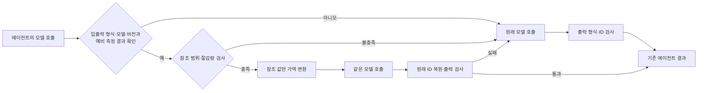

# 참조 ID 축약·복원 어댑터

## 무엇을 바꾸는 기능인가

**모델이 문서를 고를 때 긴 문서 ID를 그대로 읽고 쓰는 대신 짧은 번호를 사용하게 하고,
선택이 끝나면 실제 ID로 되돌리는 기능**이다. 문서 제목·본문·검색 점수는 유지한다.
예전의 추상적인 기능명 대신, 실제 동작을 드러내는 **참조 ID 축약·복원 어댑터**로 부른다.

검색 후보 16개 중 두 개를 예로 들면 다음과 같다. 설명을 위해 본문은 생략했으며
실제 실행에서는 본문을 줄이지 않는다.

| 단계 | 기존 모델 호출 | 어댑터를 적용한 호출 |
|---|---|---|
| 모델에 전달하는 후보 ID | `918273_54`, `209823_130` | `0`, `1` |
| 모델이 첫 번째 후보를 선택 | `selected_ids: ["918273_54"]` | `selected_ids: ["0"]` |
| 검색 결과 병합에 전달 | `918273_54` | 매핑표로 복원한 `918273_54` |

요청 내부에 `0 → 918273_54`, `1 → 209823_130` 매핑을 잠시 보관한다. 요청이 끝나면
다른 요청에서 이 매핑을 재사용하지 않는다. 같은 시각에 다른 에이전트가 `0`을 사용해도
각 호출의 매핑이 분리되어 있으므로 서로 다른 문서 ID가 섞이지 않는다.

### 왜 빨라질 수 있는가

모델은 긴 숫자·문자열 ID도 여러 토큰으로 생성한다. ID가 길고 반환할 ID가 많으면
이 과정의 시간이 커진다. 짧은 번호를 출력하게 하면 생성 토큰과 생성 단계를 줄일 수 있다.
실제 검색기 실험의 선택 단계 평균 출력 토큰은 **124.43→83.85**였다. 전체 평균 입력
토큰은 감소하지 않았으므로, 입력 처리 시간까지 줄었다고 주장하지 않는다.

### 언제 적용하고 언제 그대로 두는가

- 실제 검색기에서는 **후보 16개 이상**일 때만 적용한다. 이 기준은 예비 실험 후 고정했다.
- ID가 중복되거나 사용자의 질문·대화·본문 등 다른 곳에서도 등장하면 원래 입력을 사용한다.
- ID의 위치나 출력 형식이 예상과 다르면 원래 입력을 사용한다.
- 모델이 매핑표에 없는 번호를 반환하면 원래 ID를 넣어 **한 번만** 다시 호출한다.
  그 시간도 응답시간에 포함한다.
- ID를 바꾸면 모델의 선택이 달라질 수 있다. 원복이 가능하다는 사실과 검색 정확도가
  유지된다는 주장은 다르므로, 검색 결과와 답변 근거를 별도로 평가한다.

### 다른 에이전트에 연결하려면 무엇을 지정하는가

공통 모듈에는 법령명이나 에이전트 역할이 들어 있지 않다. 다음 **세 위치**를 지정한다.

| 설정 | 법령 검색 예 | 상품 선택 예 |
|---|---|---|
| 입력에서 후보 목록의 위치 | `laws` | `products` |
| 후보 안에서 ID의 필드 이름 | `id` | `sku` |
| 출력에서 선택 ID 목록의 위치 | `selected_ids` | `selected_ids` |

Python의 내부 설정 자료형 이름 `ReferenceContract`는 기존 코드와의 호환을 위해 유지한다.
이 자료형의 실제 역할은 위 위치와 모델·입출력 형식의 버전을 저장하는 것이다.
각 모델 호출의 전후에 연결하므로, 에이전트가 순서대로 실행되든 병렬 분기하든 반복하든
같은 축약·복원 코드를 사용할 수 있다. ID가 없는 자유 대화에는 이 기능의 가속 효과가 없다.

## 연구 질문과 현재 판단

사용자가 추가한 조건은 **기술적 새로움과 여러 멀티에이전트 구조에 적용 가능한 방법**이다.
법령 프롬프트에만 작동하는 문자열 치환을 범용 방법이라고 부르는 것으로는 부족하다.
이에 역할·연결 그래프·도메인과 분리한 호출 경계 모듈을 구현했다.

연구 질문은 다음과 같다.

> 호출의 입력 ID 위치와 출력 ID 위치를 지정해 참조 표현을 가역적으로 바꾸고, 별도 대조 실험에서
> 비용과 품질 기준을 통과한 호출 유형에만 이를 적용하면, 에이전트 연결 구조를 바꾸지
> 않고도 ID를 생성·전달하는 비용을 줄일 수 있는가?

**짧은 ID 치환 자체의 독창성을 주장하지 않는다.**
[prompt-identifiers](https://github.com/fogx/prompt-identifiers)는 가역 ID 치환과
미들웨어를 이미 제공한다. [Parrot](https://www.usenix.org/conference/osdi24/presentation/lin-chaofan)은
Semantic Variable로 LLM 호출의 연관 관계를 서비스 시스템에 전달한다.
이번 제안의 연구 대상은 **호출 유형별 적용 판단, ID가 다른 필드에도 등장하는 경우의
검사, 호출별 복원·검증의 결합**이다. 이 조합의 학술적 신규성은 선행연구와 추가
비교해야 하며 현재 구현과 실험만으로 세계 최초라고 할 수 없다.

## 기술 구성

공통 구현은 [reference_harness.py](../src/cnu_rag_optimization/reference_harness.py)다.
모듈 안에 법령 필드, 프롬프트 언어, 모델 공급자, LangGraph 등 프레임워크의 이름을
가정하지 않는다.

1. **ID 위치 지정**: 입력의 레코드 배열 경로, 식별자 필드, 출력 참조 배열 경로를
   호출자가 선언한다. 예: `products[*].sku → selected_ids[*]`.
2. **참조 범위 검사**: 중복 ID, 외부 지시문·대화·다른 값에서 쓰인 ID, 알 수 없는
   입력 구조면 변환하지 않는다. 다른 곳에 의미를 가진 문자열을 임의로 치환하지 않는다.
3. **JSON 값 위치 컴파일**: 파서가 지정된 참조 값의 원문 위치를 구한다. 그 문자열
   구간만 교체하므로 나머지 필드·순서·공백·유니코드 이스케이프가 원문 그대로다.
4. **호출별 범위**: 매핑은 한 호출의 지역 값이다. 병렬 분기에서 같은 짧은 번호를
   써도 서로 섞이지 않는다. 다음 에이전트나 도구에는 복원한 원래 ID를 전달한다.
5. **출력 형식·ID 검사**: 알 수 없는 참조, 잘못된 출력 구조는 원래 입력의 모델
   호출을 한 번 수행한다. 재시도는 읽기 전용 모델 호출에만 허용한다. 네트워크 오류와
   취소를 숨기거나 부작용이 있는 도구 호출을 반복하지 않는다.
6. **대조 결과에 따른 적용**: 입력·출력 형식, 모델, 지시문 버전이 같고 소규모 paired 대조에서
   비용 및 품질 기준을 통과했을 때 적용한다. 미등록·변경된 호출 유형은 기존 호출을 사용한다.

### 보장과 경험적 판정의 차이

입력 변환을 `E`, 복원을 `D`, 모델을 `F`라 하면 입력의 가역성 `D(E(x)) = x`를
검사할 수 있다. 그러나 **`D(F(E(x))) = F(x)`는 일반적으로 성립하지 않는다**.
따라서 구조 검증만으로 검색 정확도가 보존된다고 주장하지 않는다.

예비 비교에서는 같은 문항의 반복을 먼저 평균하고 문항 단위 paired bootstrap을 한다.
후보 시간에는 변환·검사 및 원래 입력으로 돌아간 재호출 시간을 포함한다.

`실측 절감률 = 1 − 후보의 전체 시간 합 / 기존 시간 합`

예비 비교 적용 조건은 절감률 95% 구간 하한 ≥ 2%, 평가 손실 차이 95% 구간 상한 ≤ 0.01이다.
손실 함수는 업무가 제공한다. 별도의 문항으로 최종 결과를 확인하며, 예비 비교에 쓴 문항을
확인 실험의 표본 수에 넣지 않는다. 이는 **경험적 적용 게이트**다. 특히 관측 오류가
0인 작은 표본의 bootstrap 구간은 미관측 오류를 반영하지 못하므로 통계적 안전 보증이나
정확도 비열등성 인증으로 해석하지 않는다.

## 어느 구조에 적용할 수 있는가

| 구조 | 연결 위치 | 별도 고려 사항 |
|---|---|---|
| 순차 파이프라인 | 각 단계의 모델 호출 직전·직후 | 다음 단계에는 원래 ID 전달 |
| 병렬 분기·병합 | 각 분기의 호출 경계 | 분기별 지역 매핑; 병합 로직 유지 |
| 감독자·계층형 | 감독자 또는 작업자의 구조화 호출 | 도구 실행과 라우팅은 기존 로직 유지 |
| 반복·동적 경로 | 반복마다 새 호출 범위 | 이전 반복 매핑을 재사용하지 않음 |
| 자유 대화·스트리밍 | 지정한 입출력 형식이 없으면 기존 경로 | 현재 참조 변환으로 가속하지 않음 |

호출 경계가 노출되는 프레임워크에 **연결할 수 있는 설계**다. 모든 외부 프레임워크에
대한 플러그인을 구현·검증한 것은 아니다. 현재 변환은 JSON 레코드 참조를 입력·출력하는
완결형 호출을 대상으로 한다. ID가 없거나 ID 자체가 추론에 필요한 의미를 가지는
작업에서는 효과를 기대할 수 없다. 따라서 “모든 구조에서 속도 향상”이라고 표현하지 않는다.

## 검증을 분리한다

### 실제 검색기

**2026-09-16 후속 검증:** 공통 모듈을 실제 검색기에 연결한 상태로 동시 요청 1~200의
대표 11개 지점, 총 2,896요청을 새로 측정했다. 100개에서 평균 12.32% 단축,
150개에서 완료율 79%→100%를 관측했으나 200개에서는 안정적인 지연·품질 개선을
입증하지 못했다. 낮은 reasoning을 합친 효과이며, [전체 결과와 한계](REFERENCE_ID_SCALING_RESULTS_20260916.md)를 참고한다.

[1,800요청 실험](STRUCTURED_HARNESS_RESULTS_20260915.md)은 먼저 구현한 법령 선택용
적응형 ID 어댑터로 실행했다. 공통 모듈의 예비 비교 게이트가 그 실험을 실행한 것처럼
소급해서 설명하지 않는다. 관측한 개선율은 기존 대비 평균 7.6–17.6%다.

이후 실제 선택 호출 575개의 비공개 입력으로 공통 컴파일러를 오프라인 대조했다.
기존 정책이 변환한 192개 **전부**에서 모델 입력 바이트, ID 매핑, 복원한 출력 값이
일치했다. 나머지 383개는 기존의 16개 후보 기준에서 비적용 대상이었다.
GPU를 다시 호출한 실험은 아니며 정책 변경의 종단 효과를 측정한 것도 아니다.

검색기용 얇은 연결 함수 `encode_portable_selection`과
[structured-portable.json](../integrations/2025-moleg-search/structured-portable.json)을 제공한다.
이 설정은 실제 검색기에서 검증한 **16개 후보 정책**을 유지하면서 공통 컴파일러를
사용한다. 합성 업무의 예비 비교 결과를 법령 검색기에 전용하지 않는다. 새 데이터에서 ID가
다른 필드나 대화에 나타나면 더 엄격한 범위 검사 때문에 기존 입력으로 우회할 수 있다.

### 공통 모듈의 구조 실험

[실행 스크립트](../scripts/evaluate_reference_topologies.py)는 같은 GPU 모델에서 생성한
상품·업무 티켓·서지 레코드를 사용한다. 세 도메인은 필드 이름과 데이터가 다르지만
**동일 계열의 단순 조건 필터링 작업**이다. 서로 다른 실제 업무 벤치마크로 해석하지 않는다.

- 도메인별 12개 예비 비교 문항, 기존·후보를 역순으로 2회: 144개 단일 단계 워크플로.
- 도메인별 별도 6개 확인 문항 × 순차/병렬 분기·병합/반복 × 2조건 × 2회:
  216개 멀티에이전트 워크플로.
- GPU 모델의 실제 출력으로 다음 단계의 입력을 만들고, 반복 종료도 출력 개수로 결정한다.
- 입력은 24개 UUID 레코드다. 참조 출력 비용이 큰 경우의 작동 여부를 드러내는
  합성 실험이며, 여기의 큰 단축률을 실제 법령 검색기의 개선율로 옮겨 쓰지 않는다.
- 런타임 검증기는 구조·ID 포함 관계·중복만 확인한다. 정답 필터는 실행 완료 뒤에만
  점수를 계산하므로 정답으로 모델 출력을 교체하지 않는다.
- 클라이언트 워크플로 동시성 4. 노드 호출은 병렬 구조에서 더 많이 겹칠 수 있다.
  모델·생성 옵션은 조건 간 같다. 예비 비교 종료 후 정책을 동결한다.
- 이 실험은 프레임워크를 설치한 상호운용성 시험이 아니라 Python async로 구현한
  연결 구조 시험이다. 다중 모델·장문 자유 추론·실제 도구 부작용으로 일반화하려면
  별도 검증이 필요하다.

최종 수치는 [구조 실험 자료](../experiments/results/reference-20260915/README.md)에 기록한다.

**완료:** 예비 비교 144건과 확인 216건, 총 모델 호출 768회가 정상 완료했다. 모든 합성
정답 집합이 일치했고 ID 복원 재시도는 0회였다. 확인 평균은 순차 18.62→3.74초,
병렬 15.61→3.49초, 반복 18.01→3.70초였다. 이는 참조 출력 비용이 큰 합성 조건의
결과다. 모든 예비 비교 조건이 통과했기 때문에 이 실험은 예비 비교 게이트 자체의 추가 이득을
분리해 입증하지 못한다. 해당 2026-09-15 실험 당시 코드 테스트는 **261개 통과**였다.

### 코드 동작 검사

명시 경로·이스케이프·알 수 없는 입력·동시 24워크플로의 반복 실행·원래 입력 재시도·
취소 전파·예비 평가 미통과·입출력 형식 변경을 검사한다. 공통 모듈 신규 12개를 포함한 저장소
테스트에 더해 검색기 연결의 공통 컴파일러 경로·재시도·외부 참조 우회도 검사한다.
이러한 단위 검사는 모델의 의미적 품질 증거가 아니다.

## 논문 기여로 쓸 수 있는 범위

현재 정당화할 수 있는 표현은 **“입출력 ID 위치 지정과 독립 대조 평가를 결합한
참조 ID 축약·복원 어댑터의 설계·구현 및 검색기 사례 연구”**다.
참조 치환 자체, 비동기 DAG 실행, structured output을 새 발명으로 제시하지 않는다.
학술적 신규성을 강화하려면 기존 가역 ID 미들웨어와 같은 조건의 직접 비교,
범위 검사·예비 비교 게이트 각각의 기여 분리, 다른 실제 업무·모델의 검증이 남아 있다.

새 아이디어의 후보와 확인된 실험적 사실을 구분한다. 현재 자료만으로
“어떤 멀티에이전트에서도 효과가 보장되는 새로운 알고리즘을 입증했다”라고 결론내리지 않는다.
