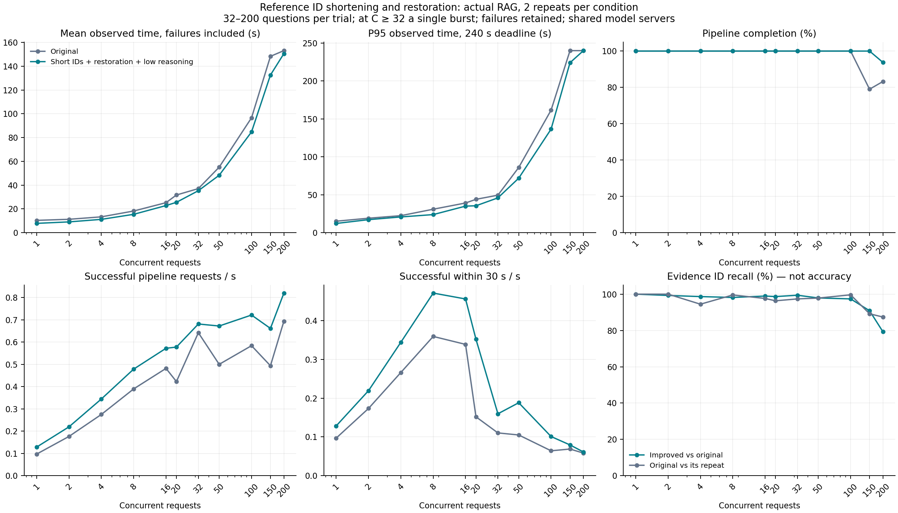

# 참조 ID 축약·복원 어댑터: 동시 요청 1~200 실측

> **완료율 정정:** 아래 원래의 “정상 완료” 수치는 내부 모델 실패를 일부 누락했습니다.
> 200개 구간의 모델·준비 단계 오류 없는 완료는 두 조건 모두 57.5%이며, 재정렬 호출도 HTTP 401로 실패했습니다.
> [원자료 재검사와 수정 지표](STAGE_OUTCOME_CORRECTION_20260916.md)를 먼저 확인하세요.

## 핵심 결과

- 전체 2,896요청 중 기존 완료 판정(정정 전) **2,741건**.
- 평균 응답시간은 11개 부하 중 11개에서 짧았다. 질문 단위 95% 구간의 하한이 0보다 큰 조건은 9개다.
- 최대 동시 요청 200: 평균 **153.16→150.65초**, p95 **240.00→240.00초**.
- 최대 부하의 평균 단축률 95% 구간은 **-1.41~4.57%**로 0을 포함한다. 이 구간의 지연 개선 근거는 불충분하다.
- 200개 구간의 기존 응답 대비 근거 ID 재현율은 79.25%다. 완료율 상승만으로 품질이 유지됐다고 판단하지 않는다.
- 이 비교는 낮은 reasoning과 참조 ID 축약·복원을 함께 적용한 결과다. 전문가 정확도 유지와 지속적인 200명 처리 용량을 입증한 것은 아니다.

## 측정한 기능

**모델에는 긴 문서 ID 대신 `0`, `1` 같은 짧은 번호를 전달하고, 모델이 고른 번호를 실제 문서 ID로 복원한다.** 문서 본문·제목·점수는 줄이지 않는다. 후보가 16개 이상일 때만 적용하고, ID가 다른 곳에도 쓰이거나 복원이 불가능하면 원래 입력을 사용한다.

이번 비교의 개선 구성에는 worker의 낮은 reasoning 설정도 포함된다. 표의 개선율은 두 기능을 합친 효과다. 새 ID 기능만의 추가 효과는 [이전 3조건 실험](STRUCTURED_HARNESS_RESULTS_20260915.md)에 따로 있다.

## 실험 규모

- 동시 요청: 1, 2, 4, 8, 16, 20, 32, 50, 100, 150, 200. 대표 11개 지점이며 1~200의 모든 정수를 측정한 것은 아니다.
- 총 **2,896요청**, 기존/개선 각 2회. 각 부하 안에서 질문·개수가 동일하고 비교 순서를 뒤집었다.
- 조건당 질문 수는 `max(32, 동시 요청 수)`. 기존 200문항 회귀셋에서 종류별 비율을 맞춰 선택했다.
- 요청 기한 240초. 실패도 평균·p95에 포함하며 성공 요청의 시간은 원자료에 별도로 제공한다.
- 모델·서빙 설정을 유지한 독립 loopback 앱 실험이다. 실제 검색 소스 124개 파일을 다시 확인했다.
- 검색 도구·설정은 같지만 모델의 검색 인자와 반환 후보는 실행마다 달라질 수 있다. ID 변환 자체는 받은 후보를 삭제하지 않는다.

## 응답시간과 완료율

각 조건의 두 반복을 합친 관측시간의 평균·p95다. 처리량은 기존 완료 판정(정정 전) 수를 두 반복의 전체 실행 시간 합으로 나눈 값이다.

| 동시 요청 | 질문 수/회 | 평균 기존→개선(초) | 평균 단축 | p95 기존→개선(초) | 응답 완료율 기존→개선(정정 전) |
|---:|---:|---:|---:|---:|---:|
| 1 | 32 | 10.31→7.79 | 24.49% | 15.04→12.08 | 100.00%→100.00% |
| 2 | 32 | 11.21→9.02 | 19.52% | 19.00→17.09 | 100.00%→100.00% |
| 4 | 32 | 13.27→11.15 | 16.00% | 22.36→20.68 | 100.00%→100.00% |
| 8 | 32 | 18.18→15.39 | 15.31% | 30.86→23.77 | 100.00%→100.00% |
| 16 | 32 | 25.20→22.77 | 9.65% | 39.08→34.95 | 100.00%→100.00% |
| 20 | 32 | 31.65→25.50 | 19.44% | 43.92→35.42 | 100.00%→100.00% |
| 32 | 32 | 37.05→35.28 | 4.79% | 49.37→45.82 | 100.00%→100.00% |
| 50 | 50 | 55.09→48.27 | 12.38% | 85.94→71.82 | 100.00%→100.00% |
| 100 | 100 | 96.64→84.74 | 12.32% | 161.51→136.47 | 100.00%→100.00% |
| 150 | 150 | 148.37→132.63 | 10.61% | 240.00→224.07 | 79.00%→100.00% |
| 200 | 200 | 153.16→150.65 | 1.64% | 240.00→240.00 | 83.25%→93.75% |

단축률이 음수인 조건은 개선 구성이 더 느렸다는 뜻이다. 시간 초과의 240초는 실제 완료 시간이 아니라 관측을 끝낸 시점이다. 시간 초과가 있는 조건의 평균·p95와 단축률은 이 관측 상한의 영향을 받으므로 완료율과 함께 읽어야 한다.

### 200개 동시 요청의 반복별 결과

| 반복 | 조건 | 정상 완료 | 평균 관측시간(초) | p95(초) |
|---:|---|---:|---:|---:|
| 1 | 기존 | 167/200 | 152.58 | 240.00 |
| 1 | 개선 | 175/200 | 164.99 | 240.00 |
| 2 | 개선 | 200/200 | 136.31 | 214.41 |
| 2 | 기존 | 166/200 | 153.74 | 240.00 |

실행 순서대로 표시했다. 공유 서버에서 두 번 측정한 결과이므로, 합산 평균뿐 아니라 반복 간 완료율·시간 변동도 확인한다.

## 처리량과 통계 구간

| 동시 요청 | 이전 판정 처리량 기존→개선(req/s) | 30초 이내 이전 판정 처리량 기존→개선(req/s) | 평균 단축률 95% 구간 |
|---:|---:|---:|---:|
| 1 | 0.097→0.128 | 0.097→0.128 | 19.60–29.12% |
| 2 | 0.176→0.219 | 0.173→0.219 | 11.99–27.70% |
| 4 | 0.275→0.344 | 0.266→0.344 | 9.00–22.87% |
| 8 | 0.390→0.479 | 0.359→0.471 | 7.79–22.58% |
| 16 | 0.482→0.572 | 0.339→0.456 | 3.83–15.09% |
| 20 | 0.423→0.577 | 0.152→0.352 | 15.48–23.51% |
| 32 | 0.642→0.681 | 0.110→0.160 | -0.14–9.86% |
| 50 | 0.500→0.672 | 0.105→0.188 | 7.48–17.04% |
| 100 | 0.584→0.721 | 0.064→0.101 | 8.29–16.33% |
| 150 | 0.494→0.661 | 0.069→0.079 | 7.21–13.99% |
| 200 | 0.693→0.820 | 0.058→0.061 | -1.41–4.57% |

질문별 반복 평균을 단위로 paired bootstrap 4,000회를 수행했다. 이 구간은 문항별 변동을 나타내며, 두 번의 실행만으로 공유 대기열과 서버 상태의 실행 간 변동을 충분히 추정한 것은 아니다. 작은 표본의 구간과 p95를 정밀한 서버 용량 추정으로 해석하지 않는다. 30초 이내 처리량은 내부 오류 없는 완료 기준이며 전문가 정답 기준의 처리량이 아니다.

## 검색 결과 변동

| 동시 요청 | 개선의 기존 응답 대비 근거 ID 재현율 | 재현율 산정 쌍 | 기존 방식 자체 반복 재현율 | ID 목록 완전 일치 | 원천 법령 포함률 기존→개선 |
|---:|---:|---:|---:|---:|---:|
| 1 | 100.00% | 56/64 | 100.00% | 98.44% | 94.44%→94.44% |
| 2 | 99.29% | 56/64 | 100.00% | 98.44% | 94.44%→94.44% |
| 4 | 98.66% | 56/64 | 94.46% | 95.31% | 94.44%→94.44% |
| 8 | 98.17% | 56/64 | 99.55% | 93.75% | 94.44%→94.44% |
| 16 | 98.96% | 56/64 | 97.62% | 95.31% | 94.44%→94.44% |
| 20 | 98.66% | 56/64 | 96.34% | 96.88% | 94.44%→94.44% |
| 32 | 99.40% | 56/64 | 97.38% | 96.88% | 94.44%→94.44% |
| 50 | 97.90% | 88/100 | 97.84% | 95.00% | 93.33%→93.33% |
| 100 | 97.39% | 176/200 | 99.63% | 93.00% | 96.67%→96.67% |
| 150 | 90.89% | 200/300 | 89.18% | 67.00% | 58.43%→88.76% |
| 200 | 79.25% | 248/400 | 87.39% | 69.75% | 57.08%→66.25% |

반환 근거 ID 재현율은 기존 응답을 기준으로 한 일치 정도다. 기존 응답이 정답이라는 뜻은 아니다. 원천 법령 포함률은 라벨이 있는 질문의 known-item 지표이며 전문가 답변 정확도와 다르다. 기존 응답에 법령이 없으면 재현율을 계산할 수 없어 그 쌍을 제외한다. 기존 응답에는 법령이 있는데 개선 응답이 비어 있으면 0점이다. 고부하에서는 기존 방식의 실패로 산정 대상이 줄어들므로 재현율을 전체 요청의 정확도로 읽지 않는다. 완료율과 산정 쌍 수를 함께 제시한다.

## 자동 답변 근거 평가

성능 측정 종료 후 첫 반복의 참조 근거가 있는 질문을 별도 모델 `microsoft/phi-4`로 평가했다. 조건명은 평가 모델에 전달하지 않았다.

| 동시 요청 | 유효 평가 기존/개선 | 관련성 기존→개선(0–2) | 근거 지지 기존→개선(0–2) | 근거 잘림 기존/개선 |
|---:|---:|---:|---:|---:|
| 1 | 10/10 · 10/10 | 1.900→1.900 | 1.900→1.900 | 0/0 |
| 20 | 10/10 · 10/10 | 1.800→1.900 | 1.900→1.900 | 0/0 |
| 100 | 33/33 · 33/33 | 1.848→1.879 | 1.848→1.879 | 0/0 |
| 200 | 65/65 · 65/65 | 0.831→0.738 | 0.846→0.723 | 0/0 |

자동 평가·소표본이며 전문가 정확도 유지 또는 비열등성을 입증하지 않는다. 구간이 0을 포함한다는 이유로 동등하다고 판정하지 않는다. 답변이 없는 요청은 0점으로 포함한다.

### 사후 확인: 200개 구간의 두 번째 반복

200개 구간에서 시간·완료율의 반복 차이와 첫 반복의 낮은 근거 점수를 확인한 뒤, 이미 저장된 두 번째 반복 답변을 같은 판정기로 추가 평가했다. 성능 요청을 새로 실행하지 않았으며, 위 사전 지정 평가를 대체하지 않는다.

- 유효 평가: 기존 65/65, 개선 65/65. 근거 잘림: 0/0건.
- 관련성(0–2): 0.754→1.385. 근거 지지(0–2): 0.785→1.369.
- 두 반복의 방향과 점수 차이가 크다. 좋은 반복만 선택해 정확도 유지나 안정적인 200개 처리 성능으로 제시하지 않는다.

실행 스크립트: `scripts/evaluate_reference_scaling_repeat.py --level 200 --repeat 1`과 프로토콜의 디렉터리·운영 파일 경로 인자.

## 어댑터 실행 기록

- 기존: 선택 호출 1,292회, ID 축약 적용 0회, 복원 실패 재호출 0회. 선택 호출 평균 출력 토큰 106.73.
- 개선: 선택 호출 1,322회, ID 축약 적용 363회, 복원 실패 재호출 0회. 선택 호출 평균 출력 토큰 78.67.

전체 집계는 실제로 달라질 수 있는 검색 경로·후보 구성의 영향도 포함한다. 입력 토큰 감소나 특정 단계만의 인과 효과를 이 집계에서 단정하지 않는다.

## 조정 모델의 캐시와 대기

두 반복에서 관측한 KV 캐시 최대 점유와 최대 대기 요청 수, 선점 횟수 증가분의 합이다. KV 점유는 모델이 유지하는 토큰 캐시의 사용 비율이다. 공유 인스턴스 관측이므로 다른 요청도 수치에 기여할 수 있다.

| 동시 요청 | KV 최대 기존→개선 | 최대 대기 요청 기존→개선 | 선점 증가 기존→개선 |
|---:|---:|---:|---:|
| 1 | 18.72%→27.19% | 1→1 | 0→0 |
| 2 | 36.91%→34.13% | 1→0 | 0→0 |
| 4 | 42.23%→45.36% | 0→1 | 0→0 |
| 8 | 61.50%→61.31% | 4→2 | 0→0 |
| 16 | 94.30%→94.01% | 2→1 | 0→0 |
| 20 | 99.91%→96.87% | 4→7 | 1→0 |
| 32 | 99.89%→99.34% | 12→13 | 0→0 |
| 50 | 99.66%→99.81% | 26→24 | 0→1 |
| 100 | 99.89%→99.71% | 68→69 | 0→0 |
| 150 | 99.72%→99.93% | 112→116 | 0→1 |
| 200 | 100.00%→99.90% | 174→176 | 82→89 |

## 관측 범위와 감사

- 32명 이상은 한꺼번에 제출한 유한 요청 묶음이다. 완료가 늘수록 실제 진행 중 요청이 줄어든다. 장시간 유지되는 동시 사용자 용량을 보장하지 않는다.
- 낮은 부하와 높은 부하의 문항 수가 다르다. 개선율은 같은 부하 안에서 비교하며, 부하 곡선을 순수한 동시성 효과만으로 해석하지 않는다.
- 모델 서버는 공유한다. 외부 부하·prefix cache 변동을 완전히 제거한 전용 환경은 아니다.
- 전체 2,896건의 문항 쌍, 실행 코드 동결, 지정 동시성 도달을 확인했다. 모델 프로세스 전후 일치: True.
- 운영 서비스에 배포하지 않았다. 비공개 질문·응답과 인증 값은 공개 결과에서 제외했다.

[측정 계획](REFERENCE_ID_SCALING_PROTOCOL_20260916.md) · [기능과 예시](REFERENCE_HARNESS_20260915.md) · [수치·설정·감사 자료](../experiments/results/reference-scaling-20260916/README.md)
