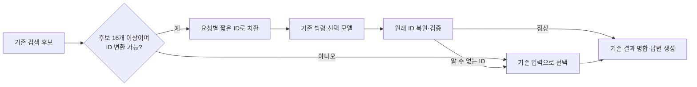

# 적응형 ID 하네스 재실험 (2026-09-15)

## 목적과 비교 대상

기존 의존성 어댑터의 고부하 지연과 결과 변동을 개선한다. 코드 확인과 실제 GPU
단계 재실행으로 변경안을 선택한 후, 별도의 문항으로 검증한다. 과거 실험 수치를
이번 개선율 계산에 섞지 않는다.

현재 실행 중인 검색 pod의 Python 소스 **124개 전체**가 실험용 동결 소스와
SHA-256 기준으로 일치했다. GPU의 vLLM은 0.19.0이며,
기존 모델 서버를 사용하는 별도 loopback 앱으로 실행한다.

## 실험한 기능

1. **JSON 입력 공백 축소**: 파싱한 데이터의 모든 필드·값·순서를 보존한다.
   그러나 모델의 판단까지 동일하지는 않았다. 예비 단계 대조에서 재현율이
   낮아져 본 실험에서는 사용하지 않는다.
2. **구조화 출력 공백 억제 / 직접 모델 연결**: 동일 JSON 스키마로 출력한다.
   예비 실험에서 preparation 출력 토큰 수가 기존과 같아 본 실험에서 제외했다.
3. **결정적 검색 도구 호출**: 준비된 인자를 도구에 직접 전달한다. 호출 제거 효과와
   검색 결과 차이를 분리하기 위해 본 실험에서는 제외했다.
4. **요청별 짧은 ID**: 선택 모델 입력의 법령 `id`만 짧은 문자열로 바꾸고, 출력은
   원래 ID로 복원한다. 법령명·국가·조문·본문·점수·순서·입력 공백·지시문을 보존한다.
   작은 후보 집합에서는 실행하지 않으며, 예비 실험으로 선택한 임계값은 **16개**다.
   이 값은 본 실험 전에 고정했다. 예비 문항의 결과는 검증 지표에서 제외한다.

짧은 ID는 JSON 표현을 가역적으로 변환한다. **모델의 선택 결과 불변성을 뜻하지
않는다.** 중복 ID, 사용자가 직접 언급한 ID, 예상 밖 데이터 구조에서는 기존 입력을
사용한다. 알 수 없는 ID를 반환하면 기존 입력으로 한 번 복구하고 횟수를 기록한다.
요청 간 매핑 공유, 완성 응답 캐시, 검색 문서 삭제, 조문 잘라내기는 없다.

## 본 실험: 사전 고정

- 기존 회귀셋 200문항 중 예비 실험 12문항을 제외하고 층화 선택한 **100개 고유 문항**.
- 동시 요청 수 **4 / 20 / 100**, 각 조건 **2회**.
- 총 **1,800요청**, 세 조건:
  - `baseline`: 기존 방식, 모델 기본 reasoning.
  - `prior`: 기존 방식 + worker `reasoning_effort=low` (저장소의 이전 개선안).
  - `improved`: `prior` + 후보 16개 이상에서 짧은 ID를 쓰는 새 하네스.
- 두 번째 반복에서 조건 순서를 역전한다. 같은 부하·반복에서는 질문 순서도 같다.
- 조건당 유한한 100요청을 측정한다. 특히 동시 요청 100개 조건은 한 번의 100요청
  부하이며, 완료가 늘면서 실제 진행 중 요청 수가 줄어든다. 지속 도착률이나 장시간
  정상 상태의 서버 최대 처리 용량을 측정한 결과로 해석하지 않는다.
- 사용자 지연은 대기·전송·SSE 종료까지 전부 포함한다. 실패와 240초 기한을 보존한다.
- 모델·프롬프트 지시문·검색기·vLLM 설정은 동일하다. 실제 모델 서버는 공유하므로
  외부 트래픽·prefix cache의 시간 변동까지 완전히 제거한 환경은 아니다.
- 개선 조건 완료율이 95% 미만이면 다음 부하 단계로 올리지 않는다. 300/500 부하는
  이전에 장애가 확인된 범위여서 이번 검증 범위에 넣지 않는다.

## 지표와 판정

- 평균·p95 지연, 성공 요청 처리량, **30초 이내 정상 파이프라인 완료율/초**.
  SSE 완료와 내부 오류 없는 파이프라인 완료를 구분한다. 이 goodput은 전문가 정답
  기준의 처리량이 아니다.
- 같은 질문의 반복 평균을 묶는 paired bootstrap 95% 구간. 실패도 지연 통계에 포함하고
  성공 응답만의 지연을 별도로 제공한다.
- 반환 법령 ID의 기존 응답 대비 재현율·정밀도·목록 일치율.
- 기존 방식 반복 간 ID 재현율·일치율을 별도로 제공해 일반적인 변동과 비교한다.
- 원천 법령 포함률은 **silver known-item 지표**이다. 정답 정확도와 동일하지 않다.
- 가능하면 조건명을 숨긴 별도 모델로 답변 관련성·근거 지지를 평가한다.
  자동 평가는 전문가 검증을 대체하지 않는다. 차이의 신뢰구간이 0을 포함한다고
  정확도 유지나 비열등성을 입증했다고 표현하지 않는다.
- `improved`와 `prior`의 차이로 새 ID 하네스 자체의 기여를 분리한다.

## 재현과 보관

실험 서버의 비공개 디렉터리에 질문·응답·단계 호출 입력을 보존하고, 저장소에는
수치·문항 해시·설정·프로토콜만 둔다. `main-plan.json`은 코드 SHA-256, 고정 문항,
비교 조건을 기록한다. 실행 전후 모델 프로세스/명령행 해시를 비교한다.

실행 진입점은 `scripts/run_moleg_structured_study.py`이며 인증 값은
`--app-env`, `--serving-env`, `--proxy-config`의 운영자 파일에서 읽는다.

## 기술 참고

- [Anthropic: Effective context engineering](https://www.anthropic.com/engineering/effective-context-engineering-for-ai-agents):
  작업에 전달하는 컨텍스트의 표현과 구성에 주목했다. ID의 가역 변환과 16개 임계값은
  이 저장소에서 구현·평가한 설계다.
- [vLLM: Structured outputs](https://docs.vllm.ai/en/latest/features/structured_outputs/):
  구조화 생성 옵션을 확인하고 설치된 0.19.0 소스의 `StructuredOutputsParams`와 대조했다.
  스키마 강제는 문법적 유효성을 제공하며 검색 정확도를 보증하지 않는다.
- [Anthropic: Demystifying evals for AI agents](https://www.anthropic.com/engineering/demystifying-evals-for-ai-agents):
  전체 실행과 개별 단계를 구분하는 평가 방식을 참고했다.
