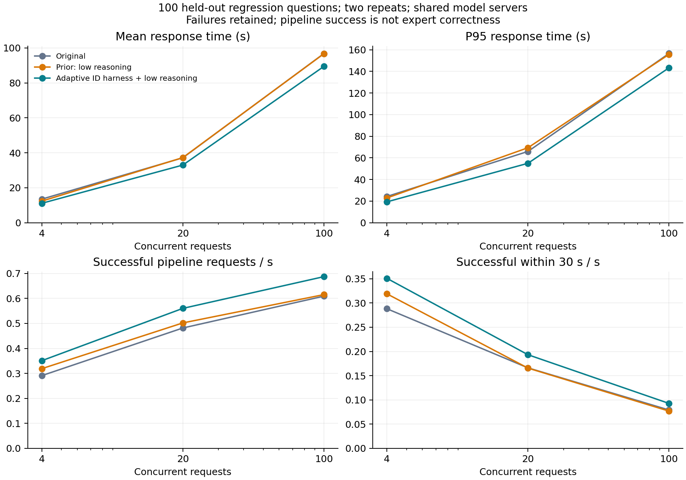

# 적응형 참조 ID 어댑터: 실제 검색기 재실험

## 결론

실제 검색기에서 **1,800요청을 완료**했다. 기존 방식 대비 평균 지연은 동시 요청
4/20/100에서 **17.6% / 11.2% / 7.6%** 감소했다. 기존 worker 낮은 reasoning
설정과 비교한 새 ID 기능 자체의 추가 단축은 **9.9% / 11.5% / 7.5%**다.
고부하의 모델 대기 병목이 해소된 것은 아니며 전문가 정확도 유지도 아직 입증하지 못했다.

이 결과는 법령 선택 단계에 연결한 ID 어댑터의 실측이다. **범용 하네스 확장판의
성능이나 새로운 알고리즘의 독창성을 검증한 수치로 바꾸어 해석하지 않는다.**
범용화 요구에 따른 추가 구현·구조 실험은 [별도 문서](REFERENCE_HARNESS_20260915.md)에 기록한다.

## 소규모 실험으로 방법을 선택한 과정

| 후보 방법 | 확인한 효과·문제 | 결정 |
|---|---|---|
| 공백 축소·도구 직접 호출·출력 제어 등 결합 | 예비 12문항에서 평균 13.41→10.66초, 기존 응답 법령 재현율 91.88% | 결합 구성 제외; 개별 효과로 분해 |
| JSON 공백 축소 | 단계 재실행에서 선택 결과 변화; 재현율 약 93.13% | 제외 |
| 모든 후보 집합에 짧은 ID | 선택 단계 가속, 작은 집합을 포함하면 재현율 약 93.13% | 일괄 적용 제외 |
| 출력 공백 제어·직접 연결 | 예비 preparation 출력 토큰 평균 134.67로 추가 감소 없음 | 본 실험 제외 |
| 후보 16개 이상에서만 짧은 ID | 해당 예비 부분집합 재현율 100%; 후보 내용과 JSON 배치 보존 | 임계값을 동결하고 별도 100문항으로 확인 |

두 단계 재실행은 각각 13개 호출 × 3조건 × 2회 = 78회다. 튜닝 문항을 본 실험에서
제외했다. 부분집합 재현율 100%는 이 작은 예비셋의 관측값이며 일반 정확도 보증이 아니다.
직접 도구 호출은 결합 예비 조건에 포함됐으므로 그 자체가 품질 저하의 원인이라고 단정하지 않는다.

## 조건

- 고유 100문항 × 3조건 × 동시 요청 4/20/100 × 2회 = **1,800요청**.
- `baseline`: 기존 방식. `prior`: worker `reasoning_effort=low`.
  `improved`: `prior` + 후보 16개 이상에서 요청별 짧은 ID.
- 매 반복에서 조건 순서를 교차했다. 모든 조건의 문항과 부하는 동일하다.
- GPU H200 NVL 2개, vLLM 0.19.0. 실제 서비스 소스 124개 파일과 실험 소스의 SHA-256 일치.
- 모델·검색 조건·지시문·vLLM 설정 유지. **선택 모델 입력의 ID 문자열은 변경**된다.
- 응답·검색 결과 캐시 없음. 문서나 본문 삭제 없음. 원래 ID로 복원한 뒤 기존 병합 실행.
- 전체 1,800건의 SSE와 내부 파이프라인이 정상 완료했다. 모델 실행 목록도 전후 동일했다.

## 지연과 처리량

조건별 200요청을 합친 평균·p95이다. 처리량은 성공 수 / 반복 실험 시간의 합이다.
각 반복의 p95나 처리량을 단순 평균하지 않았다.

| 동시 요청 | 평균 기존→개선(초) | 평균 단축 | p95 기존→개선(초) | p95 단축 | 처리량 기존→개선(req/s) |
|---:|---:|---:|---:|---:|---:|
| 4 | 13.50→11.13 | 17.55% | 24.29→19.34 | 20.39% | 0.291→0.351 (+20.55%) |
| 20 | 37.17→33.01 | 11.21% | 65.97→55.00 | 16.63% | 0.482→0.560 (+16.30%) |
| 100 | 96.82→89.46 | 7.60% | 156.60→143.37 | 8.45% | 0.609→0.687 (+12.81%) |

질문별 두 반복의 평균을 단위로 paired bootstrap 4,000회를 수행했다.

| 동시 요청 | 기존 대비 평균 단축 95% 구간 | `prior` 대비 새 기능 추가 단축 | 추가 단축 95% 구간 |
|---:|---:|---:|---:|
| 4 | 12.77–22.27% | 9.94% | 5.95–14.16% |
| 20 | 6.98–15.37% | 11.45% | 7.47–15.66% |
| 100 | 4.12–10.87% | 7.51% | 4.57–10.53% |

30초 이내 정상 완료 처리량은 4명에서 0.288→0.351, 20명에서 0.166→0.193,
100명에서 0.079→0.093 req/s였다. 전체 처리량 향상이 30초 응답 목표 달성을
의미하지 않는다. 이 지표도 전문가 정답 기준의 유효 처리량은 아니다.

## 검색 결과와 답변 근거

| 동시 요청 | 개선의 기존 응답 대비 법령 재현율 | 기존 방식 자체 반복 재현율 | 개선 목록 완전 일치율 | 원천 법령 포함률 기존→개선 |
|---:|---:|---:|---:|---:|
| 4 | 99.00% | 98.79% | 92% | 98.33→98.33% |
| 20 | 98.29% | 98.47% | 89% | 98.33→98.33% |
| 100 | 93.00% | 91.37% | 84% | 97.50→98.33% |

재현율은 기준에 법령 ID가 있는 176쌍/부하에서 계산했다. 원천 법령 포함률은
라벨이 있는 60고유 문항의 반복에서 계산한 silver known-item 지표다.
고부하에서는 기존 방식 자체도 결과가 달라진다. 다만 그 변동을 근거로 개선안의
오류를 정당화하거나 **정확도 비열등성을 선언할 수는 없다**.

성능 측정 종료 후 조건명을 숨긴 자동 근거 평가 288건을 수행했다.
부하별 32문항 × 3조건이며 첫 반복만 평가했다. 모두 파싱됐고 근거 잘림은 없었다.
평가 모델은 `microsoft/phi-4`다.

| 동시 요청 | 관련성 기존→개선(0–2) | 근거 지지 기존→개선(0–2) |
|---:|---:|---:|
| 4 | 1.8125→1.8750 | 1.8750→1.9063 |
| 20 | 1.8750→1.8750 | 1.8750→1.9063 |
| 100 | 1.8750→1.8750 | 1.8750→1.9063 |

자동 평가의 관측 평균은 나빠지지 않았다. 단일 평가 모델·소표본이며 전문가 법령
정답 검증을 대체하지 않는다. 신뢰구간이 0을 포함한다는 이유로 품질 유지라고 판정하지 않는다.

## 어떤 비용이 줄었는가

개선 조건에서 관측한 선택 호출 575개 중 192개에 ID 변환이 적용됐고 복원 실패
재호출은 0건이었다. 전체 선택 단계의 평균 출력 토큰은 기존 124.43에서 83.85로
약 32.6% 감소했다. `prior`의 123.99와 비교해도 감소한다.

반면 평균 입력 토큰은 기존 5,472.84에서 개선 5,517.89로 감소하지 않았다.
조건마다 실제 검색 후보가 변동하므로 이 집계로 입력 prefill 가속을 주장할 수 없다.
확인된 설명은 **긴 식별자를 생성하는 출력 비용의 감소**이며, 전체 지연의 차이는
검색 경로·공유 모델 대기 등도 포함한다.

## 해석 범위와 산출물

100개 요청을 한 번에 제출하는 C100은 시간이 지나면서 진행 중 요청이 줄어드는
유한 부하다. 지속적인 100명 사용 환경의 최대 용량 측정이 아니다. 반복은 2회이며
공유 엔진의 외부 부하와 prefix cache 변동을 완전히 제거하지 못했다.

- [사전 프로토콜](STRUCTURED_HARNESS_PROTOCOL_20260915.md)
- [수치·설정·감사 자료](../experiments/results/structured-20260915/README.md)
- [적용 설정](../integrations/2025-moleg-search/structured-adaptive.json)
- [그래프 PDF](../experiments/results/structured-20260915/performance.pdf)

실험용 독립 앱에서 검증했다. 운영 서비스에는 배포하지 않았다.
