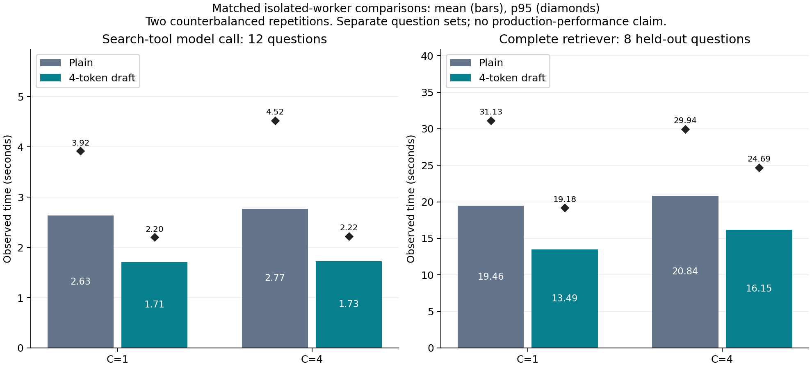

# 검색 모델의 4토큰 추측 디코딩: 실제 GPU 실험

## 적용한 기능

모델이 다음 토큰 하나를 계산할 때마다, 입력에 이미 등장한 연속 토큰에서 다음 4토큰을
찾아 제안한다. 원래 모델이 이 제안을 함께 검증하고, 수락한 토큰만 출력한다.
사용자 요청·모델 호출·검색 후보를 줄이지 않고 **토큰을 생성하는 실행 방식**을 바꾼다.
별도 초안 모델은 사용하지 않는다.

이 n-gram 추측 디코딩은 [vLLM의 기존 기능](https://docs.vllm.ai/en/v0.19.0/features/speculative_decoding/)이다.
이번 결과 자체를 새 알고리즘의 검증으로 주장하지 않는다. 호출 유형·배치별 검증 비용으로
제안 길이를 고르는 [선택 모듈](DRAFT_BUDGET_IMPLEMENTATION_20260916.md)은 구현했지만,
실제 동적 엔진 연결과 비용 보정은 미완료다. 고정 k=4의 효과부터 확인했다.

## 1. 실제 도구 입력 재생: 96건 완료

실제 검색기의 준비 단계 결과로 입력을 동결했다. 별도 워밍업 2문항과 측정 12문항을 사용했다.
동시 1/4 × 무추측/4토큰 × 2반복이며 실행 순서는 **무추측→4토큰 / 4토큰→무추측**이다.
각 조건을 시작할 때 별도 모델 프로세스를 새로 띄워 동일하게 워밍업했다.

| 동시 요청 | 평균 기본→4토큰 | 평균 단축률 (질문별 95% 구간) | p95 기본→4토큰 | 처리량 기본→4토큰 |
|---:|---:|---:|---:|---:|
| 1 | 2.633→1.711초 | 35.03% (30.58~39.12%) | 3.924→2.204초 | 0.380→0.584 req/s |
| 4 | 2.767→1.725초 | 37.64% (32.23~42.17%) | 4.524→2.223초 | 1.312→2.158 req/s |

- **96/96건**이 정상 도구 호출로 종료됐고 예상한 도구 인자와 같았다.
- 조건 사이 도구 출력 해시 **48/48쌍 일치**. 호출 ID를 제외한 함수명·파싱한 인자를 비교했다.
- 질문별 반복 평균을 단위로 bootstrap 4,000회. 12문항의 작은 탐색 표본이다.
- 양쪽 모두 모델의 KV 토큰 용량은 **158,608**, 관측 선점은 0회였다.
- 4토큰 조건에서 제안 2,712토큰 중 1,146토큰이 수락됐다(42.26%). 수락률은 속도의 대체 지표가 아니다.
- 준비 단계 14회와 모델 워밍업 8회는 측정 96건과 별도다.

이는 **검색 도구 호출 구간**의 HTTP 지연이다. 전체 검색 시간·순수 GPU 커널 시간·동적 정책의
성능으로 해석하지 않으며, 비용 선택 모듈의 보정값으로 사용하지 않는다.

## 2. 별도 질문의 전체 검색 확인

단계 재생의 14문항을 제외한 원천 법령 라벨 보유 질문에서 워밍업 1개와 측정 8개를 선택했다.
동시 1/4, 두 조건, 순서를 뒤집은 2반복으로 **64건**을 완료했다.
기존 검색기의 분류·준비·검색·선택·답변 경로 전체를 실행했다.

| 동시 요청 | 평균 기본→4토큰 | 평균 단축률 (질문별 95% 구간) | p95 기본→4토큰 | 오류 없는 처리량 기본→4토큰 |
|---:|---:|---:|---:|---:|
| 1 | 19.456→13.494초 | 30.64% (23.34~35.52%) | 31.127→19.178초 | 0.051→0.074 req/s |
| 4 | 20.840→16.151초 | 22.50% (19.68~25.41%) | 29.943→24.686초 | 0.168→0.210 req/s |

- **64/64건** 모두 관측된 내부 단계·외부 의존 기능 오류 없이 완료했다.
- 조건 사이 32쌍 모두 단계별 모델 호출 수와 검색 실행 횟수가 같았다.
- 32쌍 모두 반환 근거 ID 집합이 같았다. 기본 조건 자체 반복도 같았다.
  라벨이 있는 원천 법령 포함률은 양쪽 100%였다. 이는 전문가 답변 정확도가 아니다.
- 최종 답변의 텍스트 해시는 32쌍 중 10쌍만 같았다. 평균 답변 글자 수는 C1에서
  429.1→382.6, C4에서 371.1→433.9였다. 출력 길이 제한을 변경하지 않았지만 생성 결과의
  자연 변동이 있으므로, 답변 내용까지 동일하다고 주장하지 않는다.
- 참조 답변이 있는 4문항의 C4 응답을 두 반복에서 자동 평가했다(16판정).
  양쪽 관련성·근거 지지 평균은 모두 2/2, 평가 오류·근거 잘림은 0건이다.
  첫 성능 반복을 본 뒤 추가한 탐색 평가이며 전문가 동등성의 증거가 아니다.
- 단계별 평균 누적 모델 호출시간에서 답변 구간은 C1 9.38→4.70초, C4 8.58→5.66초였다.
  검색 도구 구간도 C1 3.34→2.16초, C4 3.45→2.30초였다. 겹친 구간의 합은 종단 시간과 다르다.
- 전용 worker 서버의 모델 호출 수와 총 입력 토큰 수는 각 부하·조건에서 34회와 56,542토큰으로 같았다.
  평균 생성 토큰은 C1 174.1→168.3, C4 161.3→178.0이었다. C4에서는 출력이 늘었는데도 빨라졌다.
  서버가 기록한 호출당 디코딩 구간은 C1 6.22→3.45초, C4 5.97→3.95초였다.
  이는 서버 요청 지표이며 동기화한 엔진 비용 보정이나 순수 GPU 커널 시간이 아니다.
- 기존 추적의 입력 해시에는 요청별 로그 ID가 포함된다. 따라서 이 해시의 차이를 모델에
  전달한 프롬프트 변화로 해석할 수 없으며, 스트리밍 입력의 바이트 단위 동일성도 검증하지 못했다.
  같은 앱 소스·설정과 공개된 단계 호출 수를 확인한 범위로 한정한다.

**판정:** 별도 32문항의 확대 예비 실험으로 진행한다. 이 8문항 확인만으로 대규모 실험을
통과한 것으로 처리하지 않는다. 워밍업 4회는 측정 64건과 별도다.

## 3. 확대 예비 실험

앞선 단계·종단 측정 및 워밍업에 사용한 23문항을 모두 제외했다. 별도 워밍업 1문항과
27개국 측정 32문항, 동시 4/16/32, 두 조건, 3반복으로 **576건**을 완료했다.
평균 단축은 **22.30% / 27.74% / 25.77%**, 관측 오류 없는 완료는 575/576건이다.
참조 답변 보유 14문항의 C32 응답 84건을 사전 지정해 자동 평가했다.

통신 실패 1건과 기본 자체 반복보다 큰 근거 변동으로 **64~200개 본 실험에 승격하지 않았다**.
최종 수치·계측·실패 원인 확인 범위는 [확대 검증 보고서](WORKER_DRAFT_CONFIRMATION_20260916.md)를 참조한다.

## 실행 환경과 해석 범위

- H200 NVL, vLLM 0.19.0, `openai/gpt-oss-20b`. 두 조건에서 모델·프롬프트·도구 스키마·
  temperature=0·낮은 worker reasoning을 동일하게 유지했다. 출력 토큰 제한을 새로 줄이지 않았다.
- 기존 서빙 프로세스를 유지하고 GPU0 여유 메모리에 실험 모델을 하나씩 실행했다.
  `gpu_memory_utilization=0.155`, `max_model_len=32768`, `max_num_seqs=4`, eager 실행이 공통이다.
  이 공통 실행 설정은 실험 중 같으며, 운영 worker의 GPU 위치·컴파일·문맥 한도와는 다르다.
- 따라서 결과는 **같은 설정의 격리 모델끼리 비교한 수치**다. 운영 배포의 예상 개선율을 보장하지 않는다.
- 전체 검색의 두 앱은 같은 worker 주소와 동일 설정을 사용한다. 재정렬 인증은 양쪽 정상이고
  하네스의 동시 모델 호출 제한은 양쪽 모두 비활성이다. 다른 모델의 경로는 같다.
- 호출 역할을 동일 모델의 실험 주소로 연결하는 어댑터는 추가 재시도를 하지 않으며,
  생성 옵션을 보존하고 스트림을 닫는다. 기본 실행에서는 이 경로가 비활성이다.
- 추론 엔진 계층의 방식이므로 정적/동적 에이전트 그래프에 의존하지 않는다. 하지만 호환되는
  자체 서빙 엔진이 필요하며 모든 API 공급자·모델·부하에서 효과가 있다는 뜻은 아니다.
- 예비 통과 후에만 큰 실험을 진행한다. 이 문서의 C1/C4는 새 방법의 C1~200 실험 완료를 뜻하지 않는다.

[원시 숫자·설정](../experiments/results/draft-budget-20260916/README.md)
