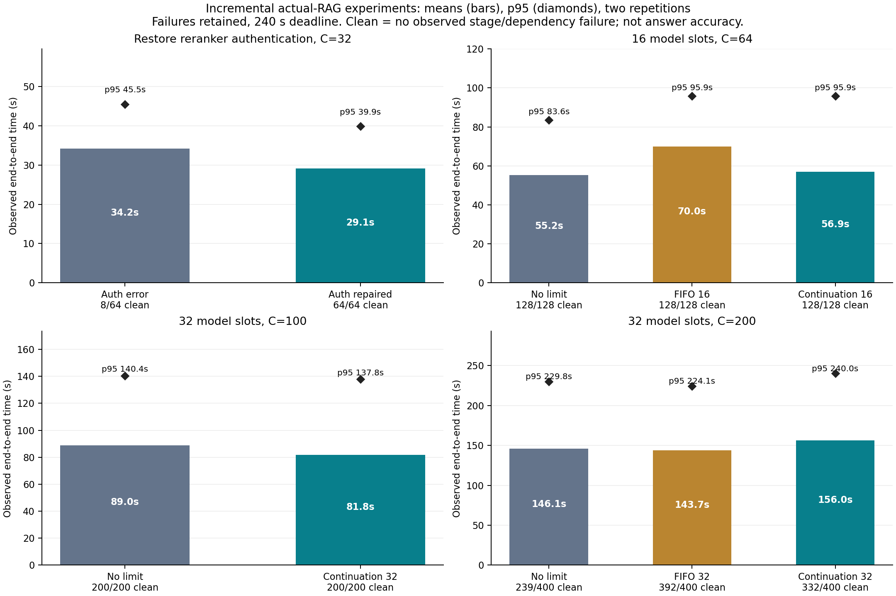

# 기능 보완 실험 자료

회수·검증을 마친 새 실험은 **2,264요청**이다. 200개 동시 요청 3조건·2반복의
1,200요청과 자동 근거 평가 200건을 네트워크 복구 후 회수했다.
`unretrieved-main-status.json`은 이전 미회수 기록에 현재 회수 상태를 추가한 이력이다.

| 폴더 | 내용 | 새 요청 수 |
|---|---|---:|
| `pilot-auth` | 재정렬 인증 오류 상태 vs 정상, C4/32, 2회 | 256 |
| `pilot-dispatch` | 인증 정상, 제한 없음 vs 선착순 16 vs 후속 우선 16, C4/64, 2회 | 408 |
| `pilot-window32` | 인증 정상, 제한 없음 vs 후속 우선 32, C100, 2회 | 400 |
| `validation200` | 인증 정상, 제한 없음 vs 선착순 32 vs 후속 우선 32, C200, 2회 | 1,200 |
| `prior-correction` | 이미 공개한 2,896건의 단계 실패 재검사. 새 실험이 아님 | — |

## 읽는 순서

- `stage-outcomes.json`: 추적 기록으로 검증한 단계·외부 기능 상태와 응답시간.
- `audited-requests.jsonl`: 요청별 새 판정. 추적이 없는 완료는 성공으로 추정하지 않는다.
- `requests.jsonl`, `summary.json`: 기존 수집기의 원시 수치와 응답 완료 판정. `pipeline_ok`는 내부 실패를 놓칠 수 있으므로 새 성공률로 쓰지 않는다.
- `evidence-comparison.json`: 반환 근거 ID의 대조군 일치 정도와 대조군 자체 반복 변동. 정확도 지표가 아니다.
- `completion-comparison.json`(있는 경우): 질문별 반복을 묶은 완료율 차이와 bootstrap 구간.
- `plan.json`, `audit.json`: 조건, 문항 해시, 코드·설정 동결과 감사. 인증 예비 계획의 설정 해시 누락은 감사 파일에 명시했다.
- `artifact-sha256.json`: 공개 파일 무결성. 질문·응답 원문과 인증 값은 포함하지 않는다.

C100은 평균 88.97→81.82초(8.04% 감소)였지만 단축률 95% 구간 −1.45~16.01%가
0을 포함한다. 두 조건 모두 내부·외부 기능 오류 없이 200/200건 완료했고 원천 법령
포함률은 각각 116/120이었다. 전문가 정확도 유지나 지속적인 사용자 용량의 증거는 아니다.

C200 오류 없는 완료는 제한 없음 239/400, 선착순 392/400, 후속 우선 332/400이었다.
후속 우선의 평균은 146.08→156.02초로 악화됐다. [전체 결과·자동 평가와 한계](../../../docs/CONTINUATION_RESULTS_20260916.md)를 참조한다.



## 재계산

```bash
python scripts/summarize_moleg_continuation_evidence.py --directory PATH_TO_ONE_STUDY
python scripts/summarize_moleg_completion.py --directory PATH_TO_ONE_STUDY
```

[구현과 적용 범위](../../../docs/CONTINUATION_HARNESS_20260916.md) ·
[실험 방법](../../../docs/CONTINUATION_PROTOCOL_20260916.md) ·
[이전 완료율 정정](../../../docs/STAGE_OUTCOME_CORRECTION_20260916.md)
