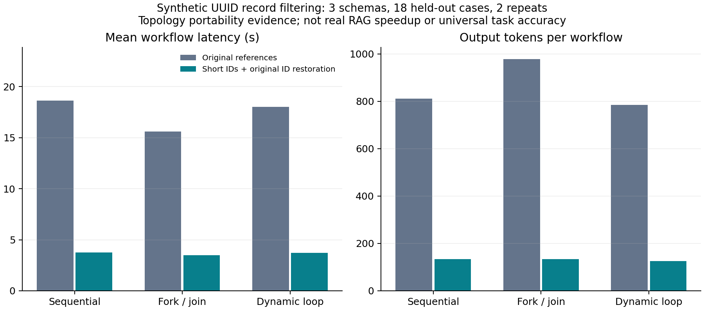

# 참조 ID 축약·복원 어댑터: 합성 구조 검증

**실제 법령 검색기의 개선율과 별개인 합성 GPU 실험**이다. 상품·티켓·서지 레코드의
필드 이름을 달리하고, UUID 24개에서 조건에 맞는 항목을 고르는 과제를 사용했다.
실행 모델은 `google/gemma-4-31B-it`, 워크플로 동시성은 4다.

## 완료 결과

예비 비교 36고유 문항 × 2조건 × 2회 = 144개 단일 단계 워크플로 이후 정책을 동결했다.
별도의 18고유 문항 × 3구조 × 2조건 × 2회 = **216개 확인 워크플로**를 완료했다.
총 모델 호출 768회, 전체 360워크플로 정상·정답 집합 일치, 복원 재시도 0회다.

| 구조 | 확인 표본/조건 | 평균 기존→개선(초) | 평균 단축 | 문항 단위 95% 구간 | p95 기존→개선(초) |
|---|---:|---:|---:|---:|---:|
| 순차형 | 36 | 18.62→3.74 | 79.90% | 78.68–80.99% | 24.98→4.82 |
| 병렬 분기·병합 | 36 | 15.61→3.49 | 77.67% | 76.14–78.99% | 19.44→4.40 |
| 동적 반복 | 36 | 18.01→3.70 | 79.45% | 78.44–80.39% | 24.92→4.98 |

18개 문항의 반복 평균을 묶어 paired bootstrap 4,000회를 수행했다. 데이터 도메인과
연결 구조만 바뀐 단순 필터 과제로, 서로 다른 실제 업무 벤치마크가 아니다. 긴 UUID를
많이 출력하는 조건이라 절감폭이 크다. 정답을 아는 필터는 평가에만 사용했다.

모델 출력으로 후속 입력을 구성했으며 동적 반복은 선택 개수에 따라 종료했다.
확인 실험의 모델 호출 수는 두 조건 각각 순차 108, 병렬 108, 반복 96회로 동일하다.
입력·출력 토큰 감소가 있었고, 모델 호출을 줄이거나 결과 캐시를 사용하지 않았다.

**한계:** 단일 모델·소표본·합성 조건이며, 세 외부 프레임워크와의 연동 시험은 아니다.
모든 출력이 일치했다는 사실이 향후 오류 확률 0이나 정확도 비열등성을 입증하지는 않는다.
모든 예비 비교 조건이 통과했으므로 이 양성 실험만으로 예비 비교 게이트 자체의 추가 기여도
입증하지 못한다. 실제 검색기에서 확인된 개선율은 평균 7.6–17.6%다.

## 자료

- `plan.json`: 고정 조건·실행 코드 해시.
- `cases.json`: 공개 가능한 생성 레코드. 운영 질문·응답은 포함하지 않음.
- `requests.jsonl`: 모든 워크플로의 시간·정확 집합 일치·토큰·호출 수. 모델 응답 원문은 저장하지 않았으므로 독립적인 원문 재채점은 불가.
- `calibration.json`: 예비 비교 단계에서 동결한 스키마별 적용 판단.
- `summary.json`: 반복별 관측값과 구조별 집계.
- `analysis.json`: 360개 조건 쌍 감사와 문항 단위 신뢰구간.
- `transfer-audit.json`: 실제 법령 선택 호출 575개에 대한 오프라인 비교. 변환 대상 192개의 입력 바이트·매핑·복원 값 모두 일치.
- `runtime-audit.json`: 동결 코드·모델 유지·독립 검색 앱 종료 확인.
- `model-inventory-after.json`: 모델 프로세스와 명령행 해시.
- `topologies.png` / `topologies.pdf`: 그림.

[설계·신규성 및 범용성의 범위](../../../docs/REFERENCE_HARNESS_20260915.md) ·
[실제 검색기 실험](../../../docs/STRUCTURED_HARNESS_RESULTS_20260915.md).
